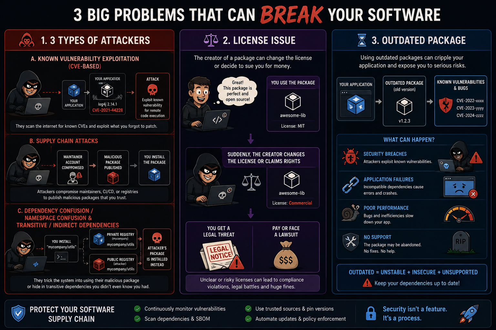
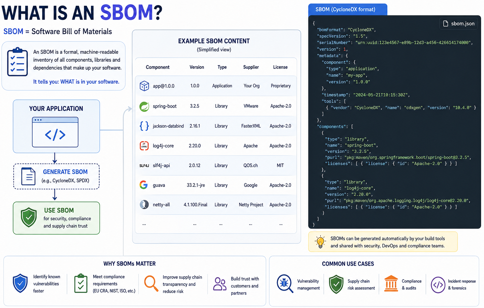
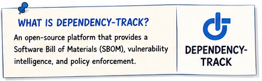
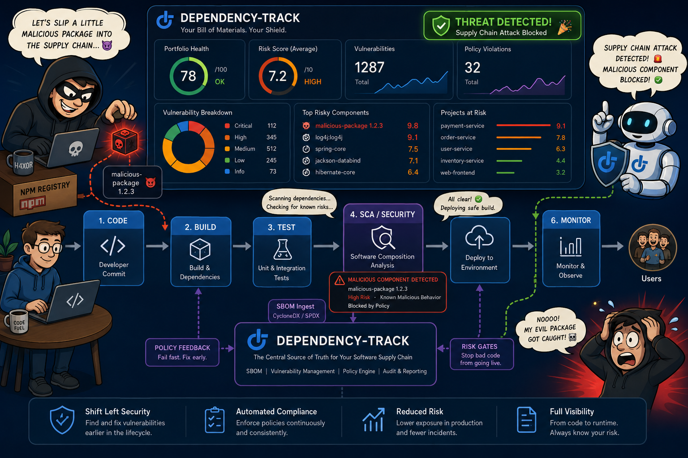
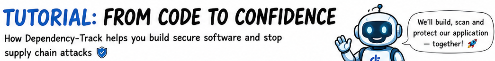
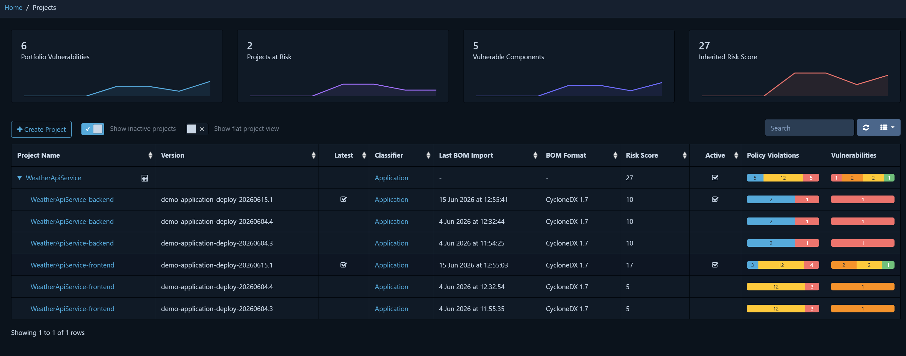
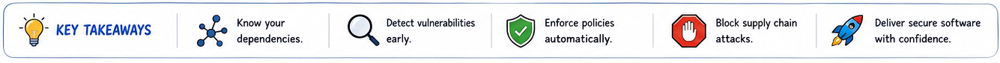

# Why Organizations Need an Open-Source Software Registry such as Dependency-Track

- [Why Organizations Need an Open-Source Software Registry such as Dependency-Track](#why-organizations-need-an-open-source-software-registry-such-as-dependency-track)
  - [The case for an open-source software registry](#the-case-for-an-open-source-software-registry)
    - [SBOM](#sbom)
    - [Open-Source Software (OSS) registry](#open-source-software-oss-registry)
    - [Dependency-Track](#dependency-track)
  - [The Open-source software (OSS) Registry with Dependency-Track Tutorial](#the-open-source-software-oss-registry-with-dependency-track-tutorial)
    - [From code to confidence](#from-code-to-confidence)
  - [Some Context](#some-context)
    - [Original case](#original-case)
    - [AI](#ai)
    - [Credits](#credits)

---

## The case for an open-source software registry

Modern software delivery depends heavily on open-source components obtained through ecosystems such as NuGet and npm. While these components accelerate the development, they also introduce governance, security, and compliance risk when they are adopted without governance and control.

Without a structured approach in managing and controlling software with external components, tools and libraries, organizations face several risks:

- Open-source packages may contain known vulnerabilities or become compromised, e.g. supply-chain attacks.
- Licensing terms may restrict or prohibit commercial or internal use, creating legal and procurement exposure.
- Business-critical applications may rely on outdated, unsupported, or low-quality dependencies that increase operational risk.

_For these reasons, implementing an open-source software (OSS) registry supported by SBOM monitoring is an important control for achieving continuous visibility and governance into the components used across the organization._

Software supply-chain incidents continue to demonstrate that dependency risk is not theoretical, and today’s AI possibilities increase those risks. At the same time, the pace of software changes and the number of external dependencies makes it increasingly difficult to assess exposure manually. Many large organizations already operate formal controls in this area, but the same need applies to mid-sized and smaller organizations. Without centralized visibility:

- **License risk can remain undetected**. Developers may introduce packages with commercially undesirable or prohibited licenses. In addition, maintainers can change licensing models over time, which means that routine upgrades may create immediate legal or commercial exposure. Recent examples are Fluent Assertions, AutoMapper and MediatR.
- **Vulnerability impact is difficult or impossible to assess quickly**. When a new vulnerability is disclosed, organizations need to determine rapidly where affected components are used. High-profile incidents such as SolarWinds, Log4Shell and the Axios supply-chain attack show the consequences of delayed visibility and response.

### SBOM

A foundational step is to produce a **Software Bill of Materials (SBOM)** for each application you develop. A SBOM is a formal, machine-readable inventory of all components, libraries, packages, and modules that make up a software product. Comparable to an ingredient list, it records what is included in a solution together with relevant metadata such as versions, suppliers, relationships, and licensing information. The SBOM not only lists direct dependencies but also all transitive dependencies they rely on.

SBOMs are now a core building block of software supply-chain security and compliance. Guidance from CISA positions SBOMs as a key mechanism for software transparency and risk management, particularly for vulnerability response and supply-chain assurance.

For every new software release, generating an up to date SBOM is mandatory. This requirement is fulfilled by integrating the SBOM generation process into the existing CI/CD pipelines, ensuring that it occurs automatically and consistently.

### Open-Source Software (OSS) registry

An SBOM provides the necessary source data, but on its own it is not sufficient. To be able to use this information effectively, organizations need a central OSS registry for all application and component usage. And a process that continuously ingests, analyzes, and monitors component data across the application portfolio. Typical requirements for such a registry include:

- Automatically import SBOMs from CI/CD pipelines for all relevant applications and services.
- Provide a central view of all software components in use, including version, license type, and origin.
- Detect license changes in OSS packages and alert when a component adopts a more restrictive license model.
- Automatically detect vulnerabilities via linked sources (NVD, OSS Index, etc.) and display them per project.
- Show exactly where vulnerable components are used, enabling impact analysis within minutes.
- Support policy rules for license compliance, including flagging prohibited or undesirable license types.
- Provide a notification mechanism (for example, email, webhook, or ticketing integration) for new vulnerabilities or license risks.
- Offer a dashboard with real-time insight into risks, vulnerabilities, licenses, and component trends.

### Dependency-Track

A starting point could be [Dependency-Track](#the-open-source-software-oss-registry-with-dependency-track-tutorial) from the OWASP Foundation. This is an open-source platform for SBOM analysis and software supply-chain risk management. Dependency-Track is widely used and is designed to inventory components, identify vulnerabilities, and enforce policy across the software portfolio.

- **Open-source platform**. Dependency-Track can be adopted without software license fees, which lowers the barrier to entry for organizations building supply-chain governance capabilities.
- **Strong governance and analysis capabilities**. It supports SBOM ingestion, vulnerability intelligence correlation, license monitoring, policy evaluation, and impact analysis across projects and portfolios.
- Operational integrations. The platform supports dashboards, notifications, webhooks, and integrations with external systems used by security, engineering, and governance teams.
- **API-first architecture**. Its API-centric model makes it suitable for integration with CI/CD pipelines, including Azure DevOps and GitHub.
- **Straightforward deployment**. The platform is relatively lightweight and can be deployed in common cloud or containerized environments.

It represents a credible and accessible starting point for establishing OSS governance. It covers all requirements. And, due to the open API-first design, it is possible to complement it with additional automation or internal services, for example, to ease project lifecycle management, SBOM upload workflows, or other integrations tailored to the necessary requirements.

Dependency-Track is not the only option on the market for SBOM platforms or Software Composition Analysis (SCA) tools, others are Syft leads OSS, FOSSA leads, Mend, Anchore Enterprise, Snyk, etc.

---

## The Open-source software (OSS) Registry with Dependency-Track Tutorial

This repository contains a tutorial on integrating [OWASP Dependency-Track](https://dependencytrack.org/) with a small full-stack demo application managed through CI/CD. It walks through using the demo application as a baseline, deploying Dependency-Track on Azure, and then wiring Dependency-Track into the demo application's build pipeline. The goal is to demonstrate how to implement an open-source software (OSS) register with SBOM monitoring and supply-chain security, providing continuous, structured visibility into all software components in use.

### From code to confidence

The `docs/` folder contains the tutorial, see [docs/README.md](docs/README.md). The other README files in the subfolders provide detailed guides and walkthroughs for each aspect of the project, such as setting up the demo application, deploying Dependency-Track on Azure, configuring it, and integrating the demo CI/CD pipeline with Dependency-Track. And finally, an opinionated helper for Dependency-Track's lifecycle management.

Start with the dummy project plan in [docs/10-project/README.md](docs/10-project/README.md). If you prefer a hands-on flow, you can skip ahead and start with the demo application.

Next, review the demo application in [docs/20-demo-application/README.md](docs/20-demo-application/README.md). This is the application you integrate with Dependency-Track. It contains a simple React frontend and .NET backend, plus a pipeline that builds both and includes dummy deploy stages for `dev`, `test`, `acc`, and `prd`. The app is intentionally simple so the tutorial can focus on Dependency-Track integration.

Then continue guide in [docs/30-dependency-track/README.md](docs/30-dependency-track/README.md) with the Dependency-Track guides. These guides cover Azure infrastructure provisioning with Bicep, Azure DevOps pipelines, and initial platform configuration. After Dependency-Track is running, it continues with the implementation of SBOM generation and upload steps to the CI/CD pipeline of the Demo app.

Finally, check [docs/40-dependency-track-helper/README.md](docs/40-dependency-track-helper/README.md) for an opinionated helper API that addresses Dependency-Track project lifecycle gaps.

---

## Some Context

### Original case

This tutorial is based on a specific use case for a customer, and the implementation choices may reflect that context.

The goal is to provide a practical example of how to implement an OSS register with SBOM monitoring, but the specific architecture and design decisions may not be universally applicable. The tutorial focuses on demonstrating the core concepts and integration patterns, rather than prescribing a one-size-fits-all solution. Depending on your organization's specific requirements, constraints, and existing tooling, you may need to adapt the implementation accordingly. The key is to understand the underlying principles and how to leverage Dependency-Track effectively within your own context.

> The code in this repository was 'recreated' based on the ideas and implementation for that customer. The the code is _simplified_ and adapted for demo purposes.

### AI

I used AI for faster prototyping, coding and documentation, I guided the AI to steer it towards the desired outcomes, tried to review everything and to fix mistakes or unclear parts, but some issues may remain. Always review code and documentation found on the internet, including this repository.

### Credits

Because this was a recreation I have NOT captured all resources that inspired the implementation. Thanks to everyone who contributed to the open-source projects, and to the people who shared their knowledge and experience in the field of software supply-chain security

---

