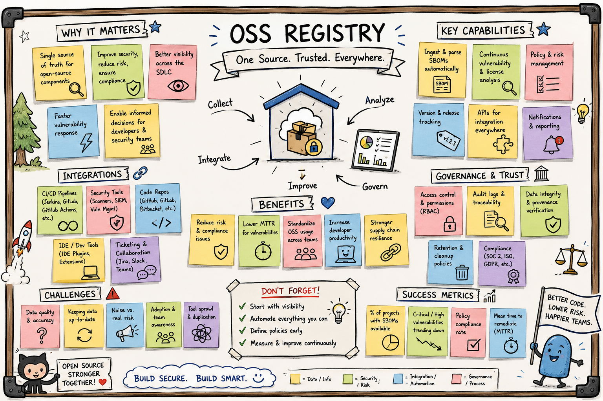
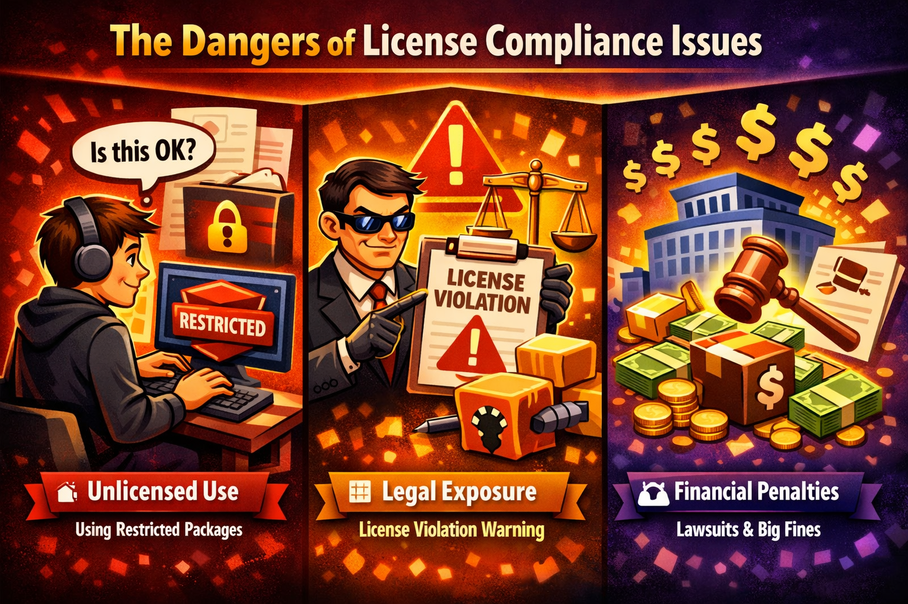
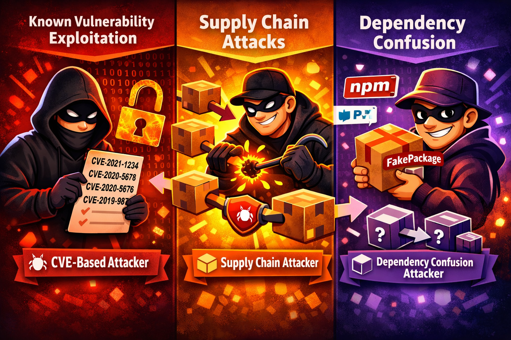
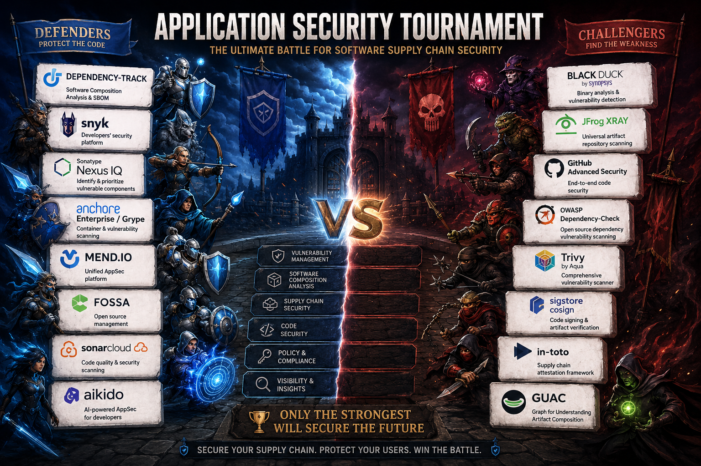

# Project Plan: OSS & Dependency Register with SBOM Monitoring

> **AI Note**: This document reflects the project plan and tool selection performed for a customer, but this report was generated with assistance from AI. It contains some of the same concepts and decisions as the original project documentation. Use it as a reference for the general approach to tool evaluation and selection, not as a verbatim template for your own project. Always perform your own research and due diligence when selecting tools for your specific context and requirements.

- [1. Project Overview](#1-project-overview)
- [2. Background & Rationale](#2-background--rationale)
- [3. Acceptance Criteria](#3-acceptance-criteria)
- [4. Tool Landscape & Comparison](#4-tool-landscape--comparison)
- [5. Decision Rationale: Dependency-Track](#5-decision-rationale-dependency-track)

---

## 1. Project Overview

This project implements an open-source software (OSS) and dependency register with SBOM monitoring and supply-chain security to gain continuous, structured visibility into all software components in use.

### Problem Statement

Our software portfolio collectively depends on hundreds of open-source packages spread across 25 to 50 applications and services managed by four development teams. Today there is no single place to answer the following questions:

- Which OSS components are running in production — and at which version?
- Are any of those components affected by a known vulnerability?
- Do any components carry a license that creates legal or commercial risk?
- When a vulnerability is publicly disclosed, which of our products is affected and how quickly can we respond?

The absence of this visibility creates growing operational, legal, and security risk with every new service and dependency added to the portfolio.

### Goal

Establish a centralized, continuously updated OSS and dependency register with automated SBOM ingestion, vulnerability monitoring, and license compliance enforcement, enabling all four development teams to detect and respond to supply-chain risks within hours instead of days.

---

## 2. Background & Rationale

### 2.1 What Is an SBOM?

A **Software Bill of Materials (SBOM)** is a formal, machine-readable inventory of all software components and dependencies that make up a given application or service. An SBOM records, at minimum:

- Component name and version
- Supplier or origin (e.g., npm, NuGet, Maven, PyPI)
- Declared license(s)
- Relationships between components (direct vs. transitive dependencies)
- A unique identifier per component (Package URL — PURL — and/or CPE)

Two dominant SBOM standards have emerged and are widely supported by tooling:

| Standard      | Governed by        | Primary formats       | Primary focus                                   |
|---------------|--------------------|-----------------------|-------------------------------------------------|
| **CycloneDX** | OWASP              | JSON, XML             | Security-first: vulnerabilities, licenses, services, hardware |
| **SPDX**      | Linux Foundation   | JSON, YAML, tag-value | License compliance, legal exchange, software identity |

SBOMs are generated at build time — from source code, package manifest files, or container images — and pushed to a management platform where they are continuously enriched with vulnerability and license intelligence. Regulations such as the **EU Cyber Resilience Act (CRA)** and executive orders backed by NIST guidance in the United States increasingly mandate SBOMs for software sold to governments or deployed in critical sectors. Adopting SBOM practices now positions the organisation ahead of these requirements.

The CycloneDX standard is selected for this project due to its security-first design and strong support for vulnerability and license metadata.

### 2.2 Why: License Risk

Open-source software is not universally "free to use in any context." OSS licenses exist on a spectrum from permissive to highly restrictive, and using the wrong license in a commercial product can carry significant legal consequences.

| License category   | Examples                           | Risk for commercial products                                                                   |
|--------------------|------------------------------------|-----------------------------------------------------------------------------------------------|
| **Permissive**     | MIT, Apache 2.0, BSD-2/3, ISC     | Low — attribution required; commercial use and redistribution permitted without source disclosure |
| **Weak copyleft**  | LGPL v2.1/v3, MPL 2.0, CDDL      | Medium — modifications to the library itself must be shared; dynamic linking is generally safe |
| **Strong copyleft**| GPL v2/v3, AGPL v3, EUPL v1.2    | **High** — derivative works or (for AGPL) network-facing services may require releasing all source code |
| **Commercial OSS** | BSL 1.1, Elastic License v2, SSPL, Commons Clause | **High** — usage in competing commercial SaaS or products is explicitly prohibited             |

Key license risks that arise without a register:

**License creep:** Popular OSS packages can change license mid-lifecycle. Well-known examples include HashiCorp moving from MPL to BSL 1.1 (2023), Elasticsearch from Apache 2.0 to SSPL (2021), and Redis switching licensing terms in 2024. Without continuous monitoring, teams may unknowingly ship a component that has silently moved to a prohibited model since the last manual audit.

**Transitive exposure:** A direct dependency with a permissive license may pull in a transitive dependency with a copyleft license several levels deep. The full dependency chain is rarely reviewed manually during code review.

**Legal liability:** Distributing a product that contains GPL-licensed code without publishing corresponding source code can expose the organisation to takedown requests, public disclosure demands, and in some jurisdictions, litigation. AGPL adds additional complexity for any software accessible over a network.

**Audit unpreparedness:** Without a structured inventory, responding to a customer compliance questionnaire, a partner due diligence request, or a regulatory audit regarding software licensing can take weeks instead of hours.

### 2.3 Why: Vulnerability & Supply-Chain Risk

Software supply-chain attacks and dependency vulnerabilities have become one of the leading threat vectors in modern software development.

**CVE disclosure lag:** A vulnerability may have existed in a widely used package for months or years before public disclosure. Without automated scanning against a live CVE database, teams rely on ad-hoc discovery through news articles, developer communities, or infrequent manual audits.

**Transitive depth:** Modern JavaScript projects routinely carry 500–1,000+ transitive dependencies; .NET and Java projects commonly exceed 200. At this scale, manual review of every dependency for every release is not feasible.

**Zero-day exposure window:** After a vulnerability is published in the NVD, organisations without automated scanning are effectively blind until someone notices and raises the alarm. Industry data consistently shows the average time-to-patch an exploitable vulnerability exceeds 30 days — a window that attackers actively exploit.

**Supply-chain attacks:** Incidents such as SolarWinds (2020), Log4Shell (2021), and the XZ Utils backdoor (2024) demonstrated that attackers increasingly target widely-used OSS packages to compromise many downstream consumers simultaneously. Knowing exactly which services use which version of a component is the prerequisite for rapid blast-radius assessment and coordinated remediation.

**Regulatory pressure:** The EU's NIS2 Directive, the Cyber Resilience Act, and ISO/IEC 27001:2022 all require organisations to maintain active visibility into software dependencies as part of a managed information security posture. Proactive SBOM adoption directly supports compliance with these frameworks.

---

## 3. Acceptance Criteria

The project is considered complete when all of the following criteria are met and verified by the Project Lead.

| ID    | Criterion                                                                                                                                                          | Verification method                                        |
|-------|--------------------------------------------------------------------------------------------------------------------------------------------------------------------|------------------------------------------------------------|
| AC-01 | SBOMs are automatically generated and uploaded to the registry on every successful build or deploy for selected applications and services.                                | CI/CD pipeline logs + registry list shows selected projects   |
| AC-02 | A central view is available showing all software components in use, including name, version, license type, and package ecosystem origin (NuGet / npm / etc.).     | Manual verification in UI                              |
| AC-03 | The solution detects license changes in monitored packages and raises a policy violation when a component adopts a more restrictive or prohibited license.     | Test scenario with a simulated license change             |
| AC-04 | Vulnerabilities are automatically detected via NVD, OSS Index, and GitHub Advisories, and displayed per project within 24 hours of feed synchronisation.          | Inject a known-vulnerable component; verify detection     |
| AC-05 | The platform shows exactly which projects and services use a vulnerable component, enabling impact analysis within minutes of a new CVE being identified.          | Test with a shared component used across multiple projects|
| AC-06 | A notification mechanism is operational: email and/or webhook notifications are sent to the relevant team channel and/or ticketing system for new Critical or High findings. | Trigger a test notification end-to-end                    |
| AC-07 | Policy rules are configured for at least the following license categories: GPL v2/v3 (prohibited), AGPL v3 (prohibited), BSL/SSPL (flagged for review), LGPL v2.1/v3 (warn). | Policy rule review + trigger test violations              |
| AC-08 | A dashboard is operational showing portfolio-level and per-project risk: vulnerability counts by severity, license risk distribution, and component inventory trends. | Manual walkthrough with project stakeholders              |
| AC-09 | The platform supports future SBOM validation as a pipeline gate: a documented API call pattern and reusable example pipeline snippet are delivered that can fail a build on policy violations. | Review of delivered documentation and example             |
| AC-10 | SBOMs are accepted and processed in CycloneDX JSON format (v1.4 or higher); SPDX ingestion confirmed if applicable to any team's toolchain.                        | Upload test with generated SBOM from each stack           |
| AC-11 | Full SBOM version history is maintained per project with timestamps, making it possible to compare component inventories between any two releases.                  | Manual verification in platform version history view      |
| AC-12 | A REST API integration test confirms the platform API is accessible from CI/CD infrastructure using an API key and can be used by other internal tooling.           | Delivered integration test script with documented result  |
| AC-13 | The project hierarchy in the selected platform reflects the organisational structure: one top-level portfolio, four team-level portfolios, and one project per application/service. | Manual verification in platform portfolio view            |
| AC-14 | An audit trail is available showing when each vulnerability was first detected, when it was acknowledged, and when it was resolved or suppressed.                   | Manual verification in platform audit log                 |
| AC-15 | Known false positives can be suppressed with a documented justification and optional expiry date, with the suppression recorded in the audit log.                   | Test suppression workflow for a known false positive      |
| AC-16 | Access to the selected platform is controlled via role-based access (OIDC/SSO or local accounts), with at minimum Administrator, Team Lead, and Read-Only roles configured and assigned. | Access control review                                     |
| AC-17 | Vulnerabilities can be filtered and prioritised by CVSS score (Critical / High / Medium / Low / Info), with Critical findings surfaced prominently on the dashboard. | Manual verification in platform UI + filter test          |
| AC-18 | Compliance and audit export is available: component reports can be exported in CSV or JSON for any given project or across the full portfolio.                       | Export test for one project and for the full portfolio    |
| AC-19 | Platform uptime and health are monitored: the platform health-check endpoint is confirmed active and integrated into the organisation's infrastructure monitoring.     | Health endpoint check + monitoring alert test             |
| AC-20 | Onboarding documentation is delivered covering all relevant technology stacks (.NET/NuGet, Node.js/npm, React/Next.js), describing step-by-step how to integrate SBOM generation into an Azure DevOps pipeline. | Document review and sign-off by at least one engineer per team |

---

## 4. Tool Landscape & Comparison

### 4.1 Evaluation Criteria

The following criteria were used to evaluate all candidate tools:

| Criterion                   | Weight | Description                                                                                    |
|-----------------------------|--------|-----------------------------------------------------------------------------------------------|
| **SBOM Ingestion**          | High   | Ability to receive CycloneDX / SPDX SBOMs from CI/CD pipelines as the primary data source    |
| **Vulnerability Detection** | High   | Automated component matching against NVD, OSS Index, GitHub Advisories, and similar feeds     |
| **License Compliance**      | High   | Detection of license types per component and enforcement of configurable policy rules          |
| **Policy Engine**           | High   | Rule-based enforcement for prohibited/warned licenses and vulnerability severity thresholds    |
| **Dashboard & Reporting**   | Medium | Portfolio and per-project views with export capabilities for audits and management reporting   |
| **CI/CD Integration**       | High   | Native or well-documented integration with Azure DevOps and GitHub Actions                    |
| **Notifications & Alerting**| Medium | Email, webhook, and ticketing system integration for new findings                              |
| **Self-hosted option**      | Low   | Ability to run on organisation-controlled infrastructure for data sovereignty and cost control |
| **REST API**                | Medium | Programmatic access enabling automation, pipeline gates, and custom integrations               |
| **Cost**                    | High   | Total cost of ownership including licensing, hosting, and operational overhead                 |
| **Maintenance burden**      | Medium | Effort required to operate, upgrade, and support the platform over time                       |

### 4.2 Comparison Matrix

| Tool                          | Type                    | SBOM Ingestion       | Vuln. Detection | License Compliance | Policy Engine | Dashboard | CI/CD Integration | Notifications | Self-hosted | Open Source | Cost (indicative, small team) |
|-------------------------------|-------------------------|:--------------------:|:---------------:|:-----------------:|:-------------:|:---------:|:-----------------:|:-------------:|:-----------:|:-----------:|-------------------------------|
| **Dependency-Track**          | OSS Platform            | ✅ CycloneDX, SPDX   | ✅ NVD, OSS Index, GitHub, VulnDB | ✅        | ✅            | ✅        | ✅                | ✅            | ✅          | ✅          | **Free** (hosting costs only) |
| **Snyk**                      | Commercial SaaS         | ✅ CycloneDX, SPDX   | ✅ Snyk DB + NVD | 🟡 Paid tier only | ✅ Paid        | ✅        | ✅                | ✅            | ❌          | ❌          | Freemium; ~€100–200/dev/yr    |
| **Sonatype Nexus IQ**         | Commercial Enterprise   | ✅                   | ✅ Sonatype OSS Data | ✅           | ✅            | ✅        | ✅                | ✅            | ✅          | ❌          | ~€25K+/yr                     |
| **Anchore Enterprise / Grype**| Commercial / OSS tools  | ✅ CycloneDX, SPDX   | ✅              | ✅ Enterprise      | ✅ Enterprise  | ✅ Ent.   | ✅                | ✅            | ✅          | 🟡 Grype/Syft OSS only | Enterprise pricing |
| **Mend.io**                   | Commercial SaaS         | ✅                   | ✅ Mend DB + NVD | ✅               | ✅            | ✅        | ✅                | ✅            | ❌          | ❌          | ~€10K+/yr                     |
| **FOSSA**                     | Commercial SaaS         | ✅                   | 🟡 Via integrations | ✅ (primary focus) | ✅        | ✅        | ✅                | ✅            | ❌          | ❌          | Freemium; paid ~€500+/mo      |
| **SonarCloud**                | Commercial SaaS         | ❌ Not primary       | 🟡 Limited SCA  | ❌               | ❌            | ✅ Code quality | ✅           | ✅            | ❌          | ❌          | Free OSS; paid per LOC        |
| **Aikido Security**           | Commercial SaaS         | ✅                   | ✅              | 🟡 Basic          | 🟡 Basic      | ✅        | ✅                | ✅            | ❌          | ❌          | ~€300–600/mo                  |
| **Black Duck (Synopsys)**     | Commercial Enterprise   | ✅                   | ✅              | ✅ Comprehensive   | ✅            | ✅        | ✅                | ✅            | ✅          | ❌          | ~€50K+/yr                     |
| **JFrog Xray**                | Commercial (Platform)   | ✅                   | ✅              | ✅               | ✅            | ✅        | ✅                | ✅            | ✅ (with Artifactory) | ❌ | Requires Artifactory; ~€15K+/yr |
| **GitHub Advanced Security**  | Platform Feature        | 🟡 Dependency graph  | ✅ Dependabot   | ❌               | ❌            | 🟡 Limited | ✅ GitHub-native  | ✅            | ❌          | ❌          | Included in GHAS license      |
| **OWASP Dependency-Check**    | OSS CLI Tool            | ❌ Not a platform    | ✅ NVD          | ❌               | ❌            | 🟡 Reports only | ✅ Plugin  | ❌            | ✅          | ✅          | **Free** (no central management) |
| **Trivy (Aqua)**              | OSS Scanner CLI         | 🟡 Generates/exports | ✅              | 🟡 Basic/indirect | ❌            | ❌ CLI-first | ✅                | ❌            | ✅          | ✅          | **Free** (OSS)                |
| **Sigstore Cosign**           | OSS Signing/Attestation | ❌ Not a registry    | ❌              | ❌               | ❌            | ❌          | ✅                | ❌            | ✅          | ✅          | **Free** (OSS)                |
| **in-toto**                   | OSS Provenance Framework| ❌ Not a registry    | ❌              | ❌               | ❌            | ❌          | 🟡 Custom integration | ❌         | ✅          | ✅          | **Free** (OSS)                |
| **GUAC**                      | OSS Graph Platform      | ✅ Ingests SBOM/attestations | 🟡 Via integrations | 🟡 Via queries/policy tooling | 🟡 Emerging | 🟡 Graph/query views | 🟡 Requires integration | ❌ | ✅ | ✅ | **Free** (OSS; ops effort) |

> **Legend:** ✅ Full support · 🟡 Partial or limited · ❌ Not supported / not primary function
> _Pricing is indicative for teams of approximately 20–30 developers and subject to change. Always validate current pricing with vendors._

### 4.3 Tool Profiles

#### Dependency-Track (OWASP)

**Type:** Open-source, self-hosted | **Website:** <https://dependencytrack.org>

Dependency-Track is the OWASP flagship project for continuous component analysis. It is built specifically around the SBOM-first model: applications push a CycloneDX (or SPDX) SBOM on every build, and Dependency-Track continuously enriches every component with vulnerability intelligence from multiple feeds. Its policy engine supports both license compliance and vulnerability severity rules. The REST API is comprehensive, well-documented, and stable across versions.

**Strengths:** Free and open source; no per-user or per-scan licensing; fully self-hosted with complete data control; CycloneDX-native; integrates with NVD, OSS Index, GitHub Advisories, Snyk Advisories (optional), and VulnDB; strong REST API suitable for pipeline gate automation; active OWASP community with regular releases; multi-project portfolio hierarchy; proven in production at organisations managing thousands of components.

**Weaknesses:** Requires hosting and operational maintenance; no vendor-backed support SLA; UI is functional but less polished than commercial SaaS alternatives; SBOM generation is not built-in — relies on external CycloneDX tools, Syft, or similar.

---

#### Snyk

**Type:** Commercial SaaS | **Website:** <https://snyk.io>

Snyk is a developer-first security platform with strong SCA, SAST, container scanning, and IaC capabilities. It offers an excellent developer experience with tight IDE and CLI integration. Its free tier is attractive for small teams but has meaningful limits. License compliance requires a paid plan, and at team scale the cost grows quickly. SBOM import and export were introduced in recent versions.

**Strengths:** Excellent developer ergonomics; strong IDE plugins for real-time feedback; automatic remediation PR suggestions; generous free tier; good Azure DevOps and GitHub Actions integration.

**Weaknesses:** SaaS-only — no self-hosting option; license compliance is paywalled; all component data is sent to Snyk's infrastructure; not designed as a central SBOM registry; cost at scale is significant.

---

#### Sonatype Nexus IQ (Lifecycle)

**Type:** Commercial Enterprise | **Website:** <https://www.sonatype.com/products/software-composition-analysis>

Sonatype is an industry leader in dependency intelligence, backed by one of the most comprehensive OSS component databases ("Sonatype Data Services"). Nexus IQ / Lifecycle integrates tightly with Nexus Repository to enforce policy at the artifact level — preventing prohibited components from ever reaching the build. Particularly strong in the Java/Maven ecosystem.

**Strengths:** Exceptional data quality and component intelligence; policy enforcement at repository ingestion level; deep Java/Maven support; proven in large enterprises.

**Weaknesses:** High cost; operationally complex; pricing model is not suited to sub-50 developer organisations; heavyweight compared to what this project requires.

---

#### Anchore Enterprise / Grype

**Type:** Commercial Enterprise (Anchore Enterprise) / Open source (Grype, Syft) | **Website:** <https://anchore.com>

Anchore is primarily a container image security platform. Its open-source components — **Syft** (SBOM generator) and **Grype** (vulnerability scanner) — are widely used as complementary CI/CD tools. Anchore Enterprise adds a management layer with policy enforcement, compliance dashboards, and an SBOM registry. The platform's primary strength is container supply-chain security.

**Strengths:** Best-in-class container SBOM generation via Syft; Grype is a high-quality, free vulnerability scanner usable standalone; strong Kubernetes ecosystem integration; enterprise policy engine.

**Weaknesses:** Container-centric focus limits relevance as a general application dependency registry; Enterprise pricing; open-source components (Grype/Syft) lack centralised management UI — they are scanning tools, not platforms.

---

#### Mend.io (formerly WhiteSource)

**Type:** Commercial SaaS | **Website:** <https://www.mend.io>

Mend.io offers comprehensive SCA with automatic vulnerability detection, license compliance, and a strong feature set around automated remediation pull requests. It supports a broad range of ecosystems and CI/CD integrations. SBOM import and export capabilities were significantly improved in recent releases.

**Strengths:** Comprehensive SCA across many ecosystems; automatic remediation suggestions via PR; strong CI/CD integrations; good license compliance feature set.

**Weaknesses:** SaaS-only — all component data leaves the organisation; cost is significant for small teams; less transparent on data sources compared to open alternatives.

---

#### FOSSA

**Type:** Commercial SaaS | **Website:** <https://fossa.com>

FOSSA is purpose-built for OSS license compliance and attribution report generation. It excels at producing legal-grade compliance documentation and SBOM exports for contract obligations or due diligence. Vulnerability detection is not a primary capability and typically defers to integrations with other tools.

**Strengths:** Best-in-class license compliance and attribution; high-quality legal reporting; free tier for public/OSS projects; SBOM generation and export.

**Weaknesses:** Vulnerability management is minimal; SaaS-only; primarily suited to legal and compliance teams rather than a development-team operational tool; does not satisfy the full scope of this project's requirements.

---

#### SonarCloud

**Type:** Commercial SaaS | **Website:** <https://sonarcloud.io>

SonarCloud is primarily a static application security testing (SAST) and code quality platform. While it includes rudimentary dependency vulnerability checks in some language analyses, it is fundamentally not an SBOM management or SCA platform. License compliance and dependency policy rules are absent.

**Strengths:** Excellent SAST and code quality analysis; free for public repositories; well-integrated into Azure DevOps; widely adopted across development teams.

**Weaknesses:** Not an SBOM management platform; limited and inconsistent SCA capabilities; no license policy engine; does not satisfy the core requirements of this project. SonarCloud is a complement to, not a replacement for, a dedicated SBOM register.

---

#### Aikido Security

**Type:** Commercial SaaS | **Website:** <https://aikido.dev>

Aikido is a modern all-in-one developer security platform covering SCA, SAST, secret scanning, container scanning, IaC scanning, and SBOM export in a single product. Positioned as a developer-friendly alternative to complex enterprise platforms, it has gained traction as a fast-to-onboard option for small and mid-size teams.

**Strengths:** Broad security coverage in a single platform; modern UX with fast onboarding; SBOM export supported; good value relative to enterprise tools; improving rapidly.

**Weaknesses:** SaaS-only — no self-hosting; license compliance policy engine is less mature; relatively new entrant with a shorter track record; customisation of policy rules is limited; all data sent to a third party.

---

#### Black Duck (Synopsys)

**Type:** Commercial Enterprise | **Website:** <https://www.synopsys.com/software-integrity/security-testing/software-composition-analysis.html>

Black Duck is the longest-standing and most comprehensive OSS compliance solution in the market, backed by the "Black Duck KnowledgeBase" — the most extensive component database in the industry. Used by Fortune 500 companies for M&A due diligence, regulatory audit preparation, and continuous supply-chain governance.

**Strengths:** Unmatched component database depth and breadth; comprehensive legal and compliance reporting; strong policy engine; multi-language support; established track record.

**Weaknesses:** Very high cost; complex deployment and administration; designed for large enterprise compliance programmes — feature complexity far exceeds the requirements of a small development organisation.

---

#### JFrog Xray

**Type:** Commercial (JFrog Platform addon) | **Website:** <https://jfrog.com/xray>

JFrog Xray is a security and compliance tool tightly coupled to JFrog Artifactory, the artifact repository manager. It provides binary-level analysis, SBOM generation, vulnerability and license scanning, and policy enforcement directly on artifacts as they are stored and promoted through the pipeline.

**Strengths:** Deep Artifactory integration enabling policy enforcement at artifact storage level; binary-level scanning; SBOM generation and export; strong policy engine.

**Weaknesses:** Requires investment in the JFrog Platform (Artifactory) to be viable — not a standalone tool; total cost is bundled with Artifactory licensing; not applicable if the organisation is not already on the JFrog Platform.

---

#### GitHub Advanced Security / Dependabot

**Type:** Platform Feature | **Website:** <https://github.com/security>

GitHub Dependabot automatically monitors dependencies for known vulnerabilities and opens pull requests to update them. GitHub Advanced Security (GHAS) extends this with secret scanning and code scanning. GitHub's dependency graph can export a basic SBOM via the API, but the platform is not designed as a centralised SBOM management or license policy system.

**Strengths:** Zero additional setup for GitHub-hosted repositories; Dependabot alerts are useful for individual developers; SBOM export capability; integrated into existing developer workflow.

**Weaknesses:** Not a centralised SBOM registry; no license compliance policy engine; limited cross-project portfolio view; SBOM export lacks depth compared to dedicated tools; not applicable as a platform-level solution for multi-repository compliance governance.

---

#### Trivy (Aqua Security)

**Type:** Open-source scanner CLI | **Website:** <https://trivy.dev>

Trivy is a fast, developer-friendly scanner for vulnerabilities, secrets, misconfigurations, and licenses across source code, filesystems, containers, and IaC. It can also generate SBOMs (CycloneDX/SPDX) and is easy to run in CI/CD pipelines. In this project context, it is best used as an SBOM/scanning producer feeding a central platform.

**Strengths:** Very simple CLI workflow; broad scan coverage in one tool; strong container and IaC support; can generate SBOMs in common formats; easy Azure DevOps/GitHub Actions integration; fully open source.

**Weaknesses:** Not a central portfolio management platform; no native multi-team risk dashboard equivalent to Dependency-Track; policy governance and historical tracking are limited without additional tooling.

---

#### Sigstore Cosign

**Type:** Open-source signing and attestation tool | **Website:** <https://www.sigstore.dev>

Cosign is part of the Sigstore ecosystem and is used to sign container images, binaries, and OCI artifacts (including SBOMs), and to attach/verify attestations. It improves software provenance and integrity by proving artifact origin and tamper resistance.

**Strengths:** Strong supply-chain integrity controls; keyless signing support (OIDC-based); good fit for CI/CD attestation workflows; broadly adopted in cloud-native ecosystems.

**Weaknesses:** Not a vulnerability or license management platform; no central dependency inventory or portfolio dashboard; must be paired with registry/analysis tooling for operational risk management.

---

#### in-toto

**Type:** Open-source supply-chain provenance framework | **Website:** <https://in-toto.io>

in-toto defines a framework for recording and verifying software supply-chain steps (who performed which step, with what inputs/outputs). It is commonly used to establish build provenance and SLSA-aligned evidence.

**Strengths:** Strong provenance model; supports tamper-evident build-step metadata; useful for high-assurance pipelines and compliance evidence.

**Weaknesses:** Not an SBOM registry or SCA platform; no built-in vulnerability intelligence or license policy enforcement; requires additional components and process design to operationalise.

---

#### GUAC (Graph for Understanding Artifact Composition)

**Type:** Open-source metadata graph platform | **Website:** <https://guac.sh>

GUAC ingests software supply-chain metadata (SBOMs, attestations, signatures, provenance) into a queryable graph model to answer complex trust and impact questions across artifacts and dependencies.

**Strengths:** Powerful cross-source relationship analysis; useful for advanced forensic and provenance queries; complements SBOM and attestation tooling.

**Weaknesses:** Still an emerging ecosystem component for many teams; requires non-trivial integration and operational maturity; not a turnkey replacement for a focused dependency risk management platform.

---

## 5. Decision Rationale: Dependency-Track

**Selected platform:** [Dependency-Track](https://dependencytrack.org) by OWASP (Apache 2.0 License)

### Summary

After evaluating all tools against the criteria defined in Section 4.1 and the acceptance criteria in Section 3, **Dependency-Track** is selected as the platform for this project. The decision is based on the following factors:

| Factor                         | Assessment                                                                                                                                                        |
|-------------------------------|------------------------------------------------------------------------------------------------------------------------------------------------------------------|
| **All acceptance criteria met**| Dependency-Track natively satisfies all 20 acceptance criteria, including SBOM ingestion, vulnerability detection, license policy enforcement, REST API, audit trail, notifications, and reporting. |
| **Zero licensing cost**        | As a fully open-source project under the Apache 2.0 license, there are no per-user, per-project, or per-scan fees. For a small development organisation, this is a decisive advantage. |
| **Self-hosted / data sovereignty** | The platform runs on organisation-controlled infrastructure. SBOMs and component inventories — which reveal the full internal technology stack — never leave the environment. |
| **CycloneDX-native**           | Dependency-Track was designed around CycloneDX. SBOMs from `cyclonedx-dotnet`, `@cyclonedx/cyclonedx-npm`, and `cyclonedx-cli` are ingested without transformation or adaptation. |
| **Multiple vulnerability sources** | Out of the box the platform integrates with NVD, OSS Index, GitHub Advisories, Snyk Advisories (optional API key), and VulnDB — providing broad and continuously updated coverage. |
| **REST API maturity**          | The Dependency-Track API is comprehensive, stable, and well-documented. It enables pipeline gates, custom integrations, and ticketing system automation via a simple API key. |
| **Active community & OWASP backing** | Maintained under the OWASP umbrella with regular releases, a responsive GitHub community, and long-term sustainability as an open standard. |
| **Proven at scale**            | Dependency-Track is deployed in production at organisations managing thousands of components and projects — well within the requirements of 25 to 50 applications and services. |

### Why Not the Alternatives?

| Tool                     | Reason not selected                                                                                                              |
|--------------------------|----------------------------------------------------------------------------------------------------------------------------------|
| **Snyk**                 | SaaS-only; license compliance requires paid plan; data leaves the organisation; cost grows with team size                       |
| **Sonatype Nexus IQ**    | Enterprise pricing (~€25K+/yr) is disproportionate; operational complexity exceeds team capacity                                |
| **Anchore Enterprise**   | Container-centric focus; enterprise pricing; open-source tier (Grype/Syft) lacks the central management this project requires   |
| **Mend.io**              | SaaS-only; significant cost; all component data sent to third party; no self-hosted option                                       |
| **FOSSA**                | Primarily a license compliance tool, not a vulnerability management platform; SaaS-only; does not cover full requirements       |
| **SonarCloud**           | Does not satisfy core requirements: no SBOM ingestion, no license policy engine, no central dependency registry                 |
| **Aikido Security**      | SaaS-only; limited policy engine maturity; data sovereignty concerns; relatively short enterprise track record                           |
| **Black Duck**           | Cost prohibitive for team size; feature complexity far exceeds organisational requirements                                      |
| **JFrog Xray**           | Requires Artifactory investment not currently in scope; total cost not justified without existing JFrog Platform usage           |
| **GitHub GHAS / Dependabot** | Not a centralised SBOM registry; no cross-project portfolio view; no license policy engine; insufficient for this project's goals |
| **OWASP Dependency-Check** | A CLI scanning tool, not a platform; no central management, no SBOM ingestion, no license compliance — complementary tool only |
| **Trivy**               | Excellent scanner and SBOM producer, but not a central management platform; best used as a feeder tool into Dependency-Track     |
| **Sigstore Cosign**     | Focused on signing and attestations; solves integrity/provenance concerns but not vulnerability and license portfolio management    |
| **in-toto**             | Provenance framework for build-step trust, not dependency inventory and policy operations; complements but does not replace platform capabilities |
| **GUAC**                | Powerful graph-based metadata analysis, but higher integration/operations effort and less turnkey for current project scope       |

---

## Next guide

Continue with the demo application pipeline walkthrough in [../20-demo-application/README.md](../20-demo-application/README.md).

