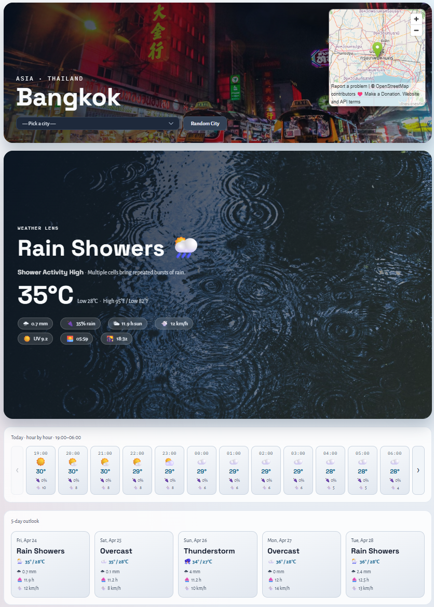

# DependencyTrack Weather App Demo Guide

This `demo` folder contains a small full-stack weather application that serves as the starting point for the Dependency-Track tutorial.

Dependency-Track is not yet integrated here. This application is the baseline that you extend when you later add SBOM generation and upload steps. The current tutorial scope is intentionally not deployed on a cloud environment.

The first section is about the tutorial steps, the last section is about the demo application itself.

---

## Tutorial Steps

### Pipeline creation

In your Azure DevOps project, create a new pipeline and point it to `demo/pipeline/application-deployment-pipeline.yml`.

Name it `WeatherDemo - App` and run it once to make sure it works before you start modifying the pipeline for the Dependency-Track integration steps.

This is the pipeline you will later extend with SBOM generation and upload steps. The pipeline uses templates for the build and deploy jobs, so you can modify those templates to add the SBOM steps without having to change the main pipeline file.

After running the pipeline, you should see:


The demo pipeline does three things:

- builds the backend and publishes a zipped artifact
- builds the frontend and publishes the `dist` artifact
- runs dummy deploy stages for `dev`, `test`, `acc`, and `prd` that confirm where real deployment steps would plug in

It does not provision or update Azure resources.


### Next guide

Continue with the Dependency-Track deployment, configuration and implementation guide in [../30-dependency-track/README.md](../30-dependency-track/README.md).

---

## The demo app

This guide uses an existing app adapted for this tutorial. This section describes the demo app at a high level.



### Frontend

The frontend lives in `demo/frontend` and is a React 19 single-page app built with Vite.

Key points:

- Loads weather data from the backend and displays a 5-day forecast with a hero view, hourly timeline, and forecast cards.
- Supports selecting a city from a list or letting the backend pick a random city.
- Supports runtime configuration through `public/app-config.json`.
- Falls back to build-time configuration when no runtime config file is available.
- Can optionally initialize Application Insights when a connection string is supplied.

Backend endpoints consumed:

| Endpoint | Purpose |
| --- | --- |
| `GET /cities` | Populate the city selector dropdown |
| `GET /weatherforecast` | Fetch forecast for a random city |
| `GET /weatherforecast/{city}` | Fetch forecast for a specific city |
| `GET /weatherforecast/{city}/hourly` | Fetch 24-hour timeline for the selected city |

Important files:

- `demo/frontend/src/App.jsx`: top-level UI logic and state management
- `demo/frontend/src/components/`: UI components (CityBanner, WeatherHero, ForecastCards, HourlyTimeline, CitySelector, CityMap)
- `demo/frontend/src/hooks/`: data-fetching hooks (useAppConfig, useWeather, useCities, useHourlyWeather)
- `demo/frontend/src/telemetry.js`: Application Insights initialisation
- `demo/frontend/public/app-config.json`: runtime API base URL configuration
- `demo/frontend/package.json`: frontend scripts such as `dev` and `build`

### Backend

The backend lives in `demo/backend/WeatherApiService.Api` and is a .NET 10 minimal API.

Key points:

- Fetches real weather data from the free [Open-Meteo](https://open-meteo.com/) API (no API key required).
- Maintains a static list of known cities (embedded `cities.json`) and falls back to the Open-Meteo geocoding API for any city not in the list.
- Exposes a health check at `GET /healthz`.
- Enables OpenAPI/Scalar in development at `/openapi/v1.json`.
- Supports optional configuration and telemetry hooks that can be used outside local development, but the current tutorial only relies on `dotnet run` and the endpoints below.

API endpoints:

| Endpoint | Purpose |
| --- | --- |
| `GET /healthz` | Health check |
| `GET /cities` | List all known cities |
| `GET /weatherforecast` | 5-day forecast for a random city |
| `GET /weatherforecast/{city}` | 5-day forecast for a named city |
| `GET /weatherforecast/{city}/hourly` | 24-hour timeline for a named city |

Important files:

- `demo/backend/WeatherApiService.Api/Program.cs`: API setup and endpoint mapping
- `demo/backend/WeatherApiService.Api/WeatherCity/WeatherCityService.cs`: Open-Meteo integration
- `demo/backend/WeatherApiService.Api/Cities/CitiesRepository.cs`: embedded city list
- `demo/backend/WeatherApiService.Api/WeatherApiService.Api.csproj`: project definition
- `demo/backend/WeatherApiService.Tests/`: unit tests for the mapper, service, and image repository
- `demo/backend/WeatherApiService.slnx`: solution file (open this in VS Code or Visual Studio)

### Azure DevOps Pipeline

The YAML pipeline lives in `demo/pipeline/application-deployment-pipeline.yml` and is a simplified version of a real-world CI/CD pipeline. You can use it in Azure DevOps Pipelines as a basic CI/CD setup. It builds frontend and backend artifacts and runs placeholder deploy jobs for `dev`, `test`, `acc`, and `prd`.

### Run Locally

To run the application locally, follow these steps:

1. Open a terminal in the repository root.
2. Restore and start the backend.
3. Install dependencies and start the frontend.

Backend:

```bash
cd demo/backend/WeatherApiService.Api
dotnet restore
dotnet build
dotnet test
dotnet run
```

Frontend in a second terminal:

```bash
cd demo/frontend
npm install
npm run dev
npm run build
```

Expected local URLs:

- Backend API: `http://localhost:5063`
- Frontend dev server: usually `http://localhost:5173`

The frontend runtime config file `demo/frontend/public/app-config.json` points to the local backend by default:

```json
{
  "apiBaseUrl": "http://localhost:5063"
}
```

To verify the backend separately, open any endpoint directly in the browser, for example `http://localhost:5063/weatherforecast` or `http://localhost:5063/healthz`.
