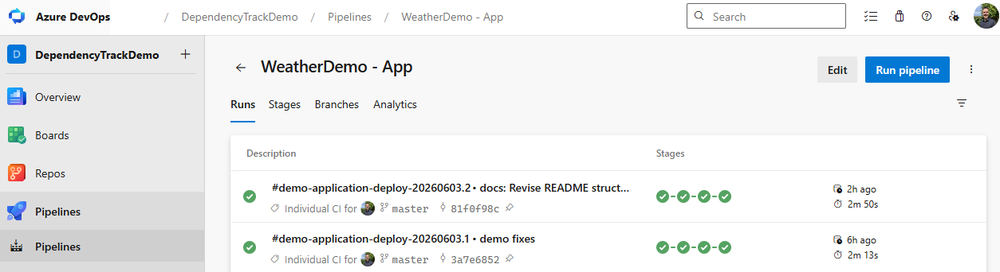
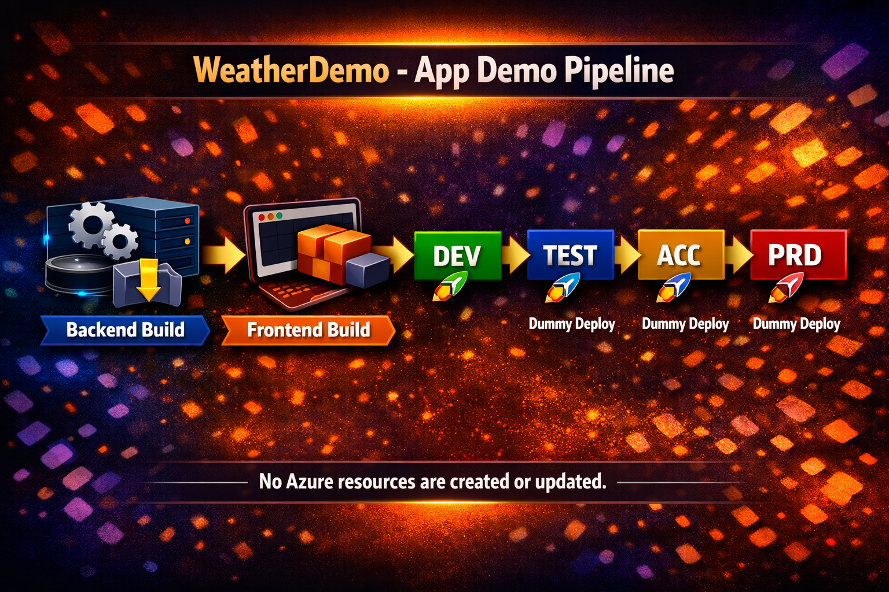

# DependencyTrack Weather App Demo Guide

This `demo` folder contains a small full-stack weather application that serves as the starting point for the Dependency-Track tutorial.

Dependency-Track is not yet integrated here. This application is the baseline that you extend when you later add SBOM generation and upload steps. The current tutorial scope is intentionally not deployed on a cloud environment.

The solution includes a React frontend, a .NET 10 backend, and an Azure DevOps pipeline that builds both artifacts and includes environment stages for `dev`, `test`, `acc`, and `prd`, each ending in a dummy deploy job.

---

## The demo app

This guide uses an existing app adapted for this tutorial. See [README-design.md](./README-design.md) for architecture and implementation details.

---

## Steps

### Pipeline creation

In your Azure DevOps project, create a new pipeline and point it to `demo/pipeline/application-deployment-pipeline.yml`.

Name it `WeatherDemo - App` and run it once to make sure it works before you start modifying the pipeline for the Dependency-Track integration steps.

This is the pipeline you will later extend with SBOM generation and upload steps. The pipeline uses templates for the build and deploy jobs, so you can modify those templates to add the SBOM steps without having to change the main pipeline file.

After running the pipeline, you should see:

The demo pipeline does four things:

- builds the backend and publishes a zipped artifact
- builds the frontend and publishes the `dist` artifact
- lets you select environment stages through the `stages` parameter
- runs dummy deploy stages for `dev`, `test`, `acc`, and `prd` that confirm where real deployment steps would plug in

It does not provision or update Azure resources.

---

## Next step

Continue with the Dependency-Track deployment, configuration and implementation guide in [../30-dependency-track/README.md](../30-dependency-track/README.md).
