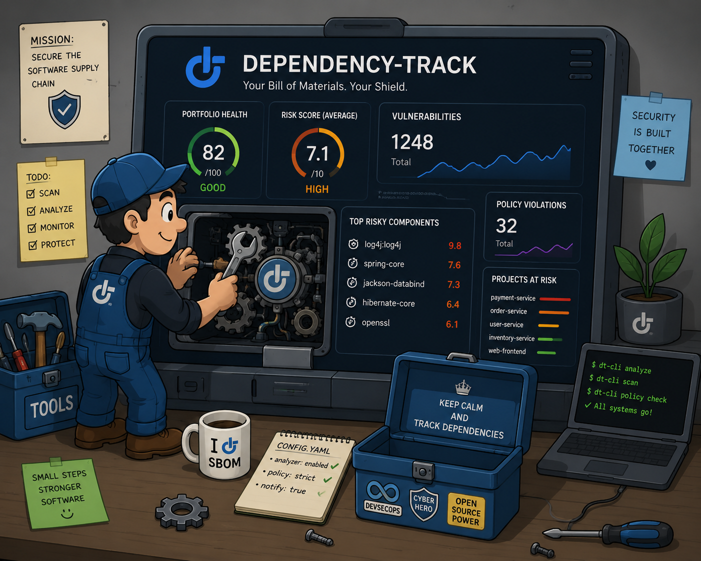
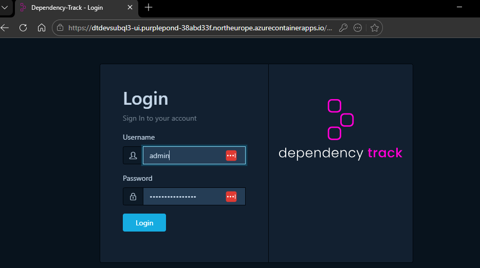
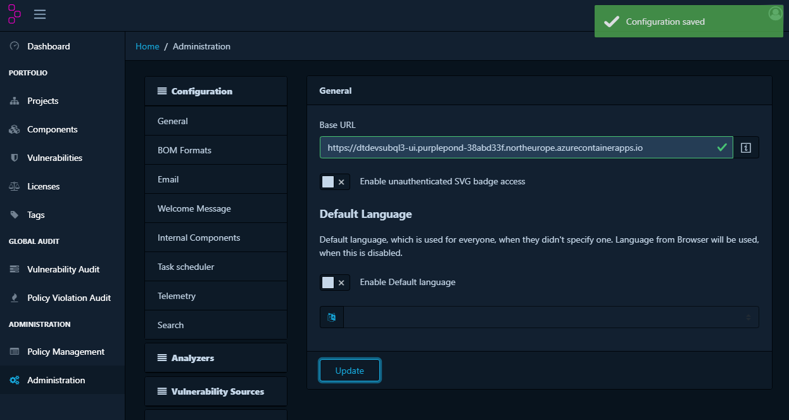
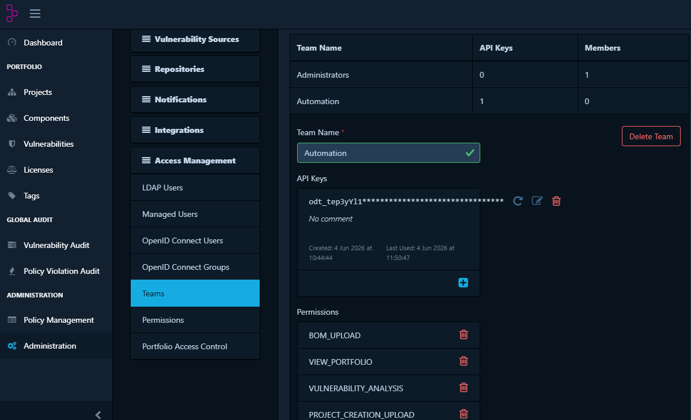
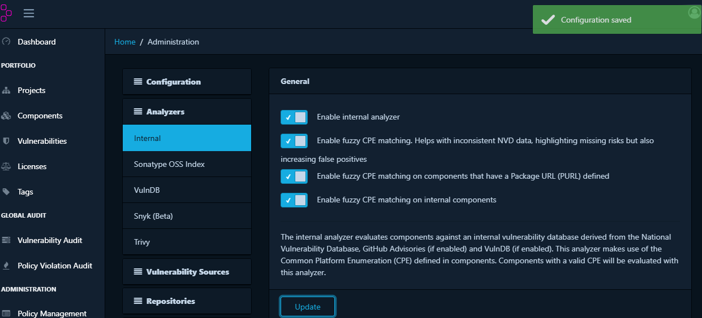
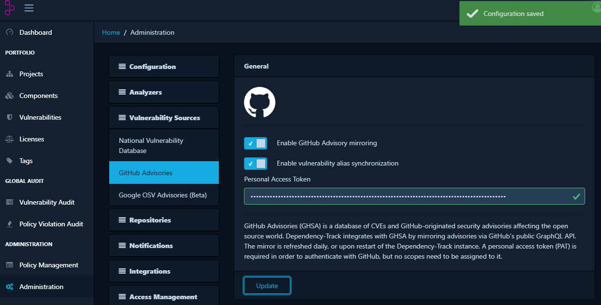
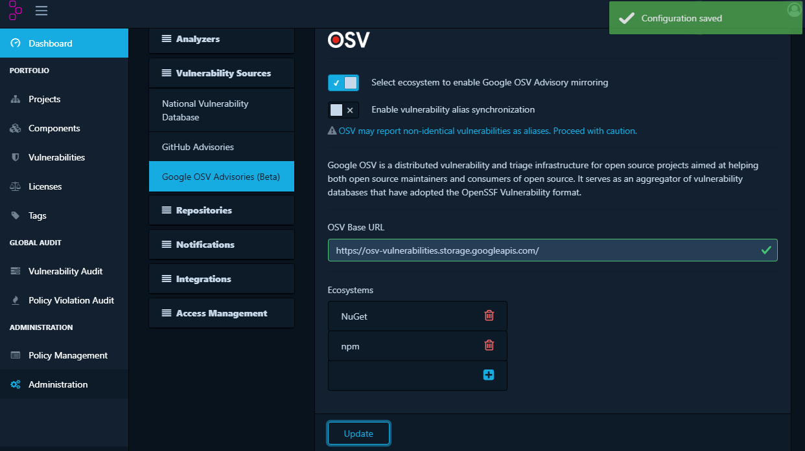
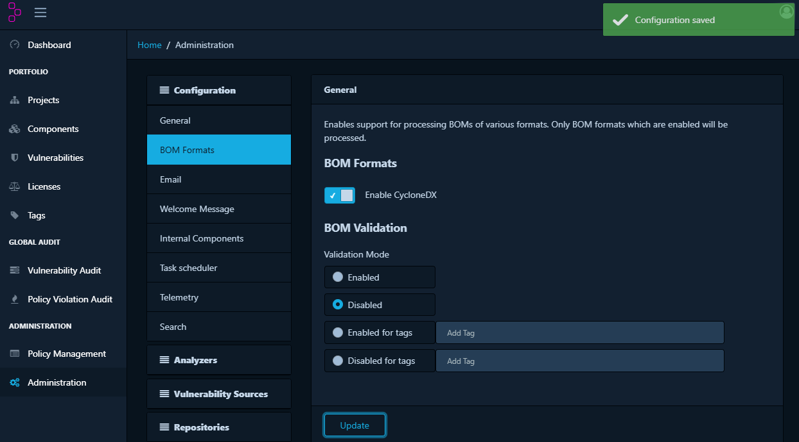
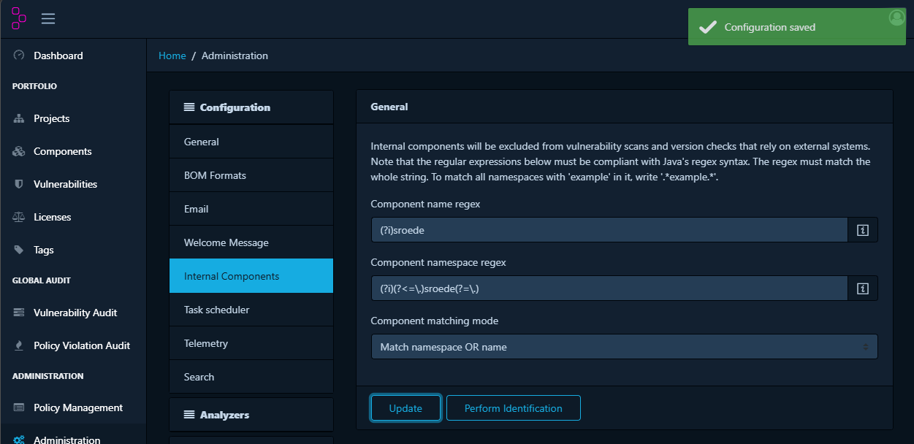
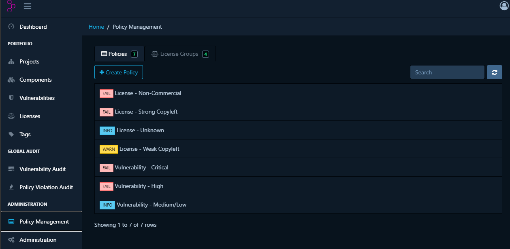

# Dependency-Track Configuration Guide

See [README.md](./README.md) for the main overview and [README-Azure-deployment.md](./README-Azure-deployment.md) for the previous steps.

This guide covers the steps to configure Dependency-Track after a successful deployment. Complete these steps before connecting any projects or uploading SBOMs.

So let configure Dependency-Track!

- [Dependency-Track Configuration Guide](#dependency-track-configuration-guide)
  - [First Login](#first-login)
    - [Change the Admin Password](#change-the-admin-password)
  - [Administration](#administration)
    - [Configure General Settings](#configure-general-settings)
    - [Manage Teams and API Keys](#manage-teams-and-api-keys)
      - [Create a team](#create-a-team)
      - [Generate an API key](#generate-an-api-key)
    - [Configure Analyzers](#configure-analyzers)
    - [Configure Vulnerability Sources](#configure-vulnerability-sources)
      - [GitHub Advisory](#github-advisory)
        - [Why CPE-to-PURL matching is unreliable](#why-cpe-to-purl-matching-is-unreliable)
      - [Google OSV Advisory](#google-osv-advisory)
      - [Disable license expression validation](#disable-license-expression-validation)
      - [Configure internal components](#configure-internal-components)
  - [Policy Management](#policy-management)
    - [Considerations](#considerations)
  - [Next steps](#next-steps)

---

## First Login

1. Open the frontend URL from the app pipeline output (e.g., `https://<baseName>-ui.<region>.azurecontainerapps.io`).
2. The login page appears. Log in with the default credentials:
   - **Username:** `admin`
   - **Password:** `admin`

> The API server can take 1–2 minutes to respond on first start while it initialises the database schema and downloads initial vulnerability feed data. If the login page appears but the API returns errors, wait 60 seconds and refresh.

### Change the Admin Password

Changing the default password is the first thing you should do before any other configuration.

1. Log in with `admin` / `admin`.
2. Click your username in the top-right corner and select `Change Password`.
3. Enter the current password (`admin`) and a new strong password.
4. Click `Update Password`.

> **Note**: strange for a product from the OWASP Foundation and it does not have any password policies, oke you should use a external authentication provider in production, but still, consider enforcing a strong password here.

---

## Administration

### Configure General Settings

Under `Administration` > `Configuration`:

| Setting | Recommended value | Notes |
| --- | --- | --- |
| **Base URL** | Your frontend URL | Used in notification e-mails and links. Set to the `frontendUrl` from the app pipeline. |
| **Default language** | As preferred | |

### Manage Teams and API Keys

Dependency-Track uses teams to control what CI/CD pipelines and users can do. An API key is associated with a team and carries that team's permissions.

#### Create a team

1. Go to `Administration` > `Access Management` > `Teams`.
2. Open the `automation` team.
3. Assign permissions to the team. For a CI/CD pipeline that uploads SBOMs and reads vulnerability results, assign at minimum:
   - `BOM_UPLOAD`
   - `VIEW_PORTFOLIO`
   - `VULNERABILITY_ANALYSIS`
   - `PROJECT_CREATION_UPLOAD`

#### Generate an API key

1. Open the team you created.
2. Click `API Keys`.
3. Click `+` to generate a new key.
4. Copy the key, it is only shown once. Store it in your CI/CD system as a secret.

The API key is passed in the `X-Api-Key` header for all authenticated API calls.

### Configure Analyzers

In this demo, enabling fuzzy matching options in internal analyzers improved the chance of matching potential CPE entries. Use this carefully, because fuzzy matching can also introduce false positives.

### Configure Vulnerability Sources

Dependency-Track mirrors vulnerability data from external sources into the `/data` directory. On first start, it downloads data from all enabled sources. This can take 10–20 minutes.

Built-in data sources enabled by default:

| Source | Description |
| --- | --- |
| **NVD** (National Vulnerability Database) | CVE records from NIST |
| **OSV** (Open Source Vulnerabilities) | Google's open-source vulnerability database |
| **GitHub Advisories** | Vulnerability advisories from GitHub |
| **VulnDB** (optional, requires license) | Commercial vulnerability data |

To configure data sources:

1. Go to `Administration` > `Vulnerability Sources`.
2. Each source has a toggle to enable it.
3. For **NVD**, optionally configure an [NVD API key](https://nvd.nist.gov/developers/request-an-api-key). Without a key, NVD uses a lower rate limit — mirroring is slower but still works.

#### GitHub Advisory

Create a GitHub personal access token (PAT) without any scopes and configure it in Dependency-Track under the GitHub Advisories configuration.

This improves vulnerability matching because the [National Vulnerability Database (NVD)](https://nvd.nist.gov/) identifies products with [CPEs](https://nvd.nist.gov/products/cpe), while modern package ecosystems such as NuGet and npm use [PURLs](https://github.com/package-url/purl-spec). For example, an AutoMapper vulnerability may be represented in NVD as `cpe:2.3:a:luckypennysoftware:automapper:*:*:*:*:*:*:*:*`, while the package in an SBOM is identified as `pkg:nuget/AutoMapper@15.1.1`.

GitHub Advisory data uses PURLs, which makes matching significantly more accurate for modern package managers.

##### Why CPE-to-PURL matching is unreliable

Matching an SBOM that uses PURLs against NVD data is a [known challenge](https://github.com/DependencyTrack/dependency-track/discussions/4180). PURLs identify specific packages, while CPEs describe broader products. Automated conversion is not always reliable. Since CVE 5.2 the CVE record format supports PURLs, but many existing vulnerability records still do not include them. GitHub Advisory data solves this gap for the NuGet and npm ecosystems.

#### Google OSV Advisory

Enable the Google OSV Advisory source for the same reason as GitHub Advisories: OSV uses PURLs natively, which improves matching accuracy for packages that NVD does not cover well.

Before enabling OSV, make sure the **NuGet** and **npm** ecosystems are selected in the OSV configuration panel inside Dependency-Track. Enabling OSV for all ecosystems is also fine but will increase the initial mirror time.

After enabling all sources, Dependency-Track starts a background mirror task. Progress can be monitored under `Administration` > `Scheduled Tasks`.

#### Disable license expression validation

Some generated SBOMs are rejected on upload because of license validation errors. Certain NuGet packages contain a license value such as `Unknown - See URL`, which Dependency-Track treats as invalid. When validation is enabled, these uploads return **HTTP 400**.

To disable validation:

1. Go to `Administration` > `Configuration`.
2. Find the **BOM Processing** section.
3. Disable the `Validate BOM before processing` toggle.
4. Click `Save`.

#### Configure internal components

Internal components are your own libraries and services. Dependency-Track excludes them from license-policy violations and can apply different vulnerability handling rules.

To identify internal components by package group:

1. Go to `Administration` > `Configuration`.
2. Find the **Internal Components** section.
3. Enter a regex pattern that matches the package group or namespace of your internal packages. For example, `^com\.example\..*` matches all packages in the `com.example` namespace.
4. Click `Save`.

Components matching the pattern are marked as internal. They appear in the component list with an **Internal** badge and are excluded from the `License - Unknown` policy condition above.

---

## Policy Management

Create policies so Dependency-Track flags license issues and known vulnerabilities. Policies are evaluated against every component in every project and surface as violations on the project findings page.

To create a policy:

1. Go to `Administration` > `Policy Management`.
2. Click `+` to create a new policy.
3. Set the **Violation State** (`Inform`, `Warn`, or `Fail`) and add one or more conditions.
4. Optionally scope the policy to specific projects or tags. Leave unscoped to apply globally.

Recommended starter policies:

| Name | Violation State | Condition(s) |
| --- | --- | --- |
| License - Non-Commercial | Fail | `License group is Non-Commercial` |
| License - Strong Copyleft | Fail | `License group is Copyleft` |
| License - Weak Copyleft | Warn | `License group is Weak Copyleft` |
| License - Unknown | Inform | `License is unresolved` AND `Component is classified as internal` is `false` |
| Vulnerability - Critical | Fail | `Severity is Critical` |
| Vulnerability - High | Fail | `Severity is High` |
| Vulnerability - Medium | Inform | `Severity is Medium` OR `Severity is Low` |

In addition to these general rules, you can define policies targeting specific packages or version ranges. This is a starting point; customize and expand policies based on your organization's risk tolerance and compliance requirements.

### Considerations

This is a starting point for policy management,a and not what i ended up for productions. Do your own experiments, but note that:

- The `License - Unknown` policy is important to identify components that are missing license information. This can be a sign of an incomplete SBOM or a component that needs manual review. By excluding internal components from this policy, you can focus on third-party dependencies that may pose legal risks. *BUT*, this policy will also create a large amount of noise if your SBOMs are missing license data for many components. If you have a large number of violations from this policy, consider improving the quality of your SBOMs or disabling the policy until you can address the underlying issue.
- The `License - Weak Copyleft` policy will flag a lot of open source components which properly will not be a problem for your organization, unlike the permissive licenses.
- Vulnerability policies are optional. If enabled, a vulnerability can appear both as a vulnerability finding and as a policy violation. Depending on your preferred workflow, you may choose to keep policies only for license rules.

---

## Next steps

After this guide, continue with [README-implementation.md](./README-implementation.md) to integrate Dependency-Track into the CI/CD pipelines of the demo application.
