# Dependency-Track Implementation Guide

See [README.md](./README.md) for the main overview and [README-configuration.md](./README-configuration.md) for the previous steps.

This guide describes how SBOM creation and upload are implemented in the demo application's Azure DevOps pipelines.

- [Dependency-Track Implementation Guide](#dependency-track-implementation-guide)
  - [Overview](#overview)
  - [Steps](#steps)
    - [Variable group setup](#variable-group-setup)
    - [CI/CD Integration](#cicd-integration)
      - [Reusable SBOM create and upload template](#reusable-sbom-create-and-upload-template)
      - [Variable group update](#variable-group-update)
      - [Build jobs update](#build-jobs-update)
  - [Dependency-Track at a glance](#dependency-track-at-a-glance)
    - [Dashboard](#dashboard)
    - [Projects](#projects)
    - [Vulnerability Audit](#vulnerability-audit)
    - [Policy Violation Audit](#policy-violation-audit)
  - [Next guide](#next-guide)

---

## Overview

The integration adds two capabilities to the demo application's existing Azure DevOps pipelines:

1. **SBOM upload** — After each build on `main`/`master`, a CycloneDX SBOM is generated for the backend (NuGet) and frontend (npm) and uploaded to Dependency-Track. Dependency-Track then analyses the components against its vulnerability and license databases.

The demo application has two build jobs defined in:

- `demo/pipeline/templates/application/build-backend-job.yml` — builds the .NET backend
- `demo/pipeline/templates/application/build-frontend-job.yml` — builds the React frontend

The SBOM steps are added to these existing jobs.

---

## Steps

In this section we go through the implementation steps. The end result is that after a build runs, two new projects appear in Dependency-Track with their own component and vulnerability list.

### Variable group setup

Create an Azure DevOps variable group named **`DependencyTrackGroup`** and link it to the demo application deployment pipeline (`demo/pipeline/application-deployment-pipeline.yml`). This group centralizes the connection details for Dependency-Track.

| Variable | Description |
| --- | --- |
| `DependencyTrackUrl` | Base URL of the Dependency-Track API server, e.g. `https://<baseName>-api.<region>.azurecontainerapps.io` |
| `DependencyTrackApiKey` | API key from the `Automation` team in Dependency-Track (store as secret) |
| `githubPat` | A GitHub PAT without additional permissions (store as secret) |

In Azure DevOps:

1. Go to `Pipelines` > `Library`.
2. Create a variable group named `DependencyTrackGroup`.
3. Add the three variables above. Mark `DependencyTrackApiKey` and `githubPat` as secret.
4. Link the group to the application deployment pipeline under `Edit` > `Variables` > `Variable groups`.

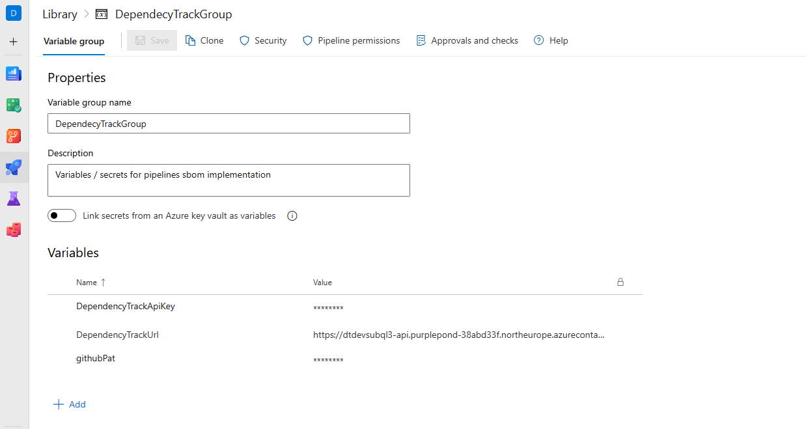

### CI/CD Integration

#### Reusable SBOM create and upload template

In your repository, create a new reusable template at `demo/pipeline/templates/application/tasks/build-create-and-upload-sbom.yml`. This file is not present in the repository today. The template wraps three steps:

1. **Generate** a CycloneDX SBOM — uses `dotnet CycloneDX` for NuGet projects and `cdxgen` for npm projects.
2. **Publish** the SBOM as a pipeline artifact so it is retained with the build.
3. **Upload** the SBOM to Dependency-Track via its REST API using the `Automation` team API key.

See the [template file](./assets/build-create-and-upload-sbom.yml) for the content and for the full implementation. The template accepts parameters for the target type (NuGet or npm), application name, component name, working directory, target file, and SBOM output directory.

*Resolving licenses*
The template queries public registries to improve license resolution. This increases build time, but significantly reduces unresolved licenses. For npm, set the environment variable `FETCH_LICENSE=true`. Also set `GITHUB_TOKEN`; otherwise, API rate limits may prevent license resolution.

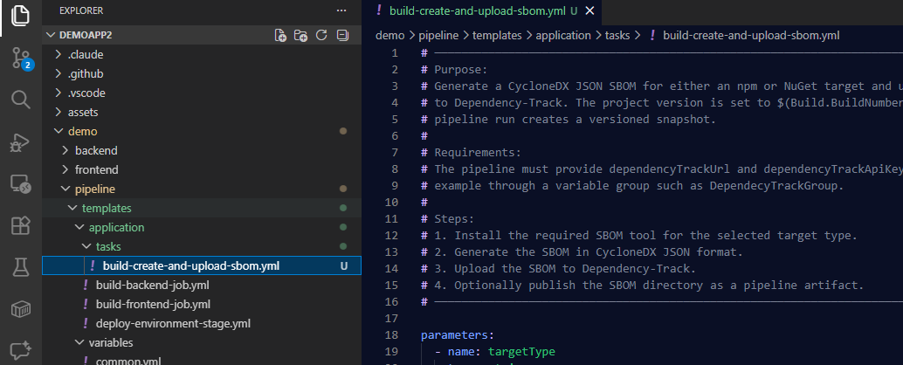

#### Variable group update

Then add the newly created variable group to the variables section in `demo/pipeline/application-deployment-pipeline.yml`:

```yaml

variables:
  - template: /demo/pipeline/templates/variables/common.yml
  - group: DependencyTrackGroup

```

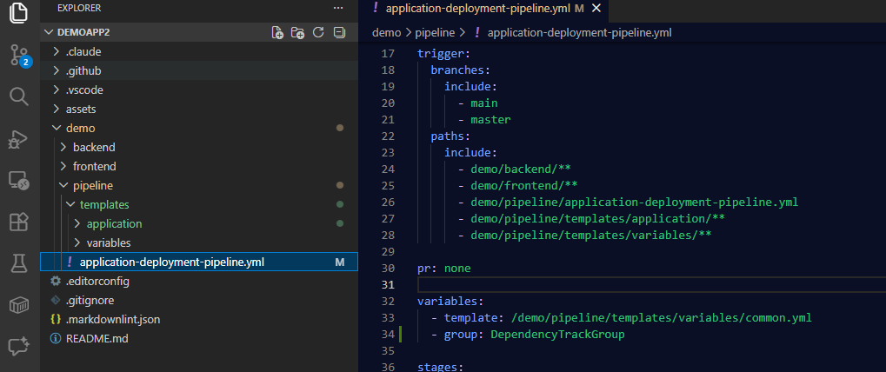

#### Build jobs update

Then edit the existing `demo/pipeline/templates/application/build-backend-job.yml` file. Add a SBOM step that runs only on builds from `main` or `master`. Insert it after the existing publish step:

```yaml
      - ${{ if or(eq(variables['Build.SourceBranch'], 'refs/heads/main'), eq(variables['Build.SourceBranch'], 'refs/heads/master')) }}:
          - template: tasks/build-create-and-upload-sbom.yml
            parameters:
              targetType: nuget
              applicationName: WeatherApiService
              applicationComponentName: backend
              workingDirectory: $(Build.SourcesDirectory)/demo/backend
              targetFile: $(Build.SourcesDirectory)/demo/backend/WeatherApiService.Api/WeatherApiService.Api.csproj
              sbomOutputDirectory: $(Build.SourcesDirectory)/demo/backend/.well-known/sbom
```

Then edit the existing `demo/pipeline/templates/application/build-frontend-job.yml` file. Add an SBOM step that also runs only on `main`/`master`. Insert it after the existing build step:

```yaml
      - ${{ if or(eq(variables['Build.SourceBranch'], 'refs/heads/main'), eq(variables['Build.SourceBranch'], 'refs/heads/master')) }}:
        - template: tasks/build-create-and-upload-sbom.yml
          parameters:
            targetType: npm
            applicationName: WeatherApiService
            applicationComponentName: frontend
            workingDirectory: $(Build.SourcesDirectory)/demo/frontend
            targetFile: $(Build.SourcesDirectory)/demo/frontend/package-lock.json
            sbomOutputDirectory: $(Build.SourcesDirectory)/demo/frontend/public/.well-known/sbom
```

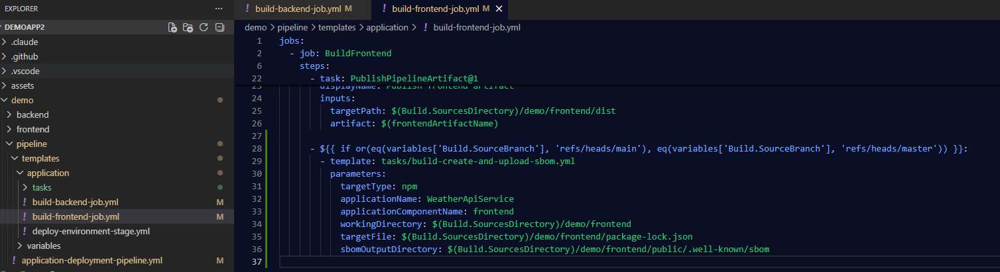

Now save and commit the changes. Then push a new commit to `main`/`master` to trigger the pipeline and review the results in Dependency-Track. Ensure permissions are granted to the variable group.

After these steps run, Dependency-Track will show two projects — `WeatherApiService (backend)` and `WeatherApiService (frontend)` — each with their own component list and vulnerability findings.

To have a clearer view for the last part of the tutorial, execute a second build.

---

## Dependency-Track at a glance

This tutorial focuses on the implementation of the SBOM upload to Dependency-Track. If you want to learn more about Dependency-Track itself, check out the [Dependency-Track documentation](https://docs.dependencytrack.org/) and the [Dependency-Track user guide](https://docs.dependencytrack.org/userguide/).

This section also gives a short tour of the Dependency-Track UI and its main features.

> **Note**: Background jobs in Dependency-Track may take time to start and complete. On the first run, downloading vulnerability data can take up to **24 hours**. If you just uploaded an SBOM, allow time for components and vulnerabilities to appear in the UI. (so be patient ;) )

### Dashboard

The dashboard provides an overview of the portfolio, including the number of projects, components, and vulnerabilities. It also highlights any critical issues that need attention. You can see the increase or decrease over time and notice if you need to investigate a sudden increase in vulnerabilities or a new critical issue.

As seen in the screenshot below, the dashboard shows that we have 2 projects (the backend and frontend), a total of 11 components across both projects, and 3 vulnerabilities. The critical issues section highlights any vulnerabilities that are marked as critical severity.

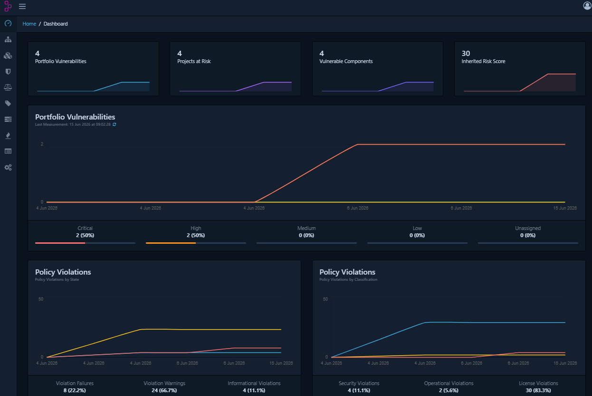

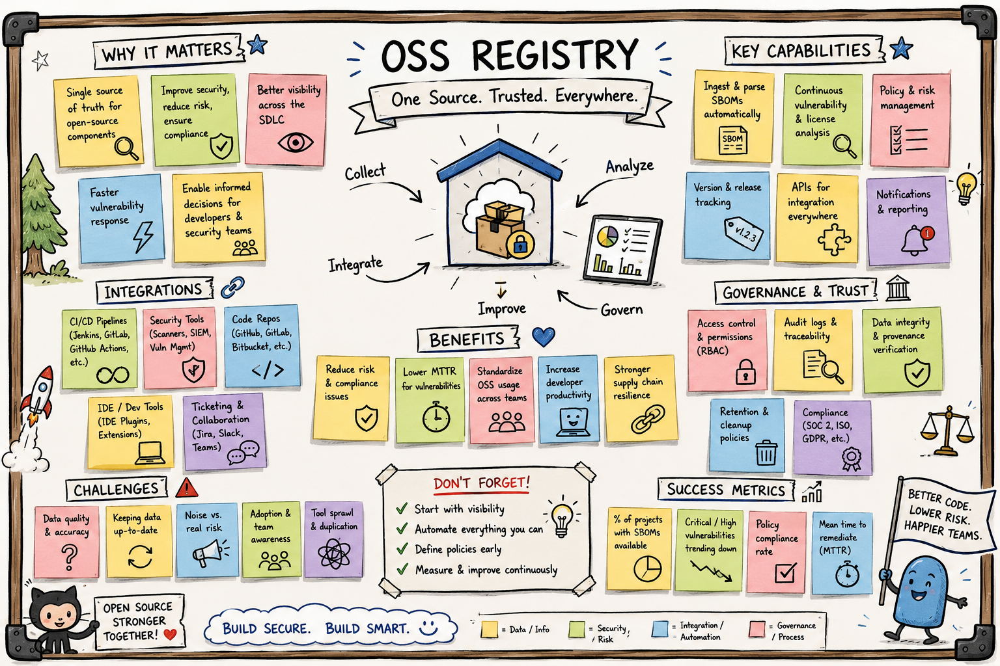

### Projects

The projects page lists all projects in the portfolio. Each project has its own page with a component list, vulnerability findings, and policy violations. This is where you can drill down into the details of each project and see which components are used and what vulnerabilities are associated with them.

As seen in the screenshot below, the `WeatherApiService (backend)` project has 3 violations and 1 vulnerability, while the `WeatherApiService (frontend)` project has 15 violations and 1 vulnerability. You can click into each project to see more details about the components and vulnerabilities.

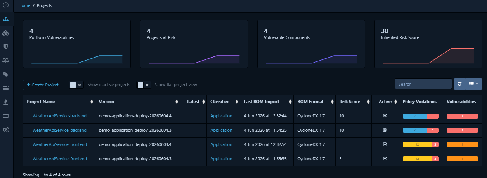

We can drill down further into the `WeatherApiService (backend)` project to see the list of components and their associated vulnerabilities. For example, we can see that the `Microsoft.AspNetCore.DataProtection` component is used in the backend project and has a known vulnerability with a critical severity.

> **Note**: As we can see, due to 2 builds, we have 2 versions for each of the two projects. As a result we see that the same vulnerabilities and same policy violations are found in the projects.

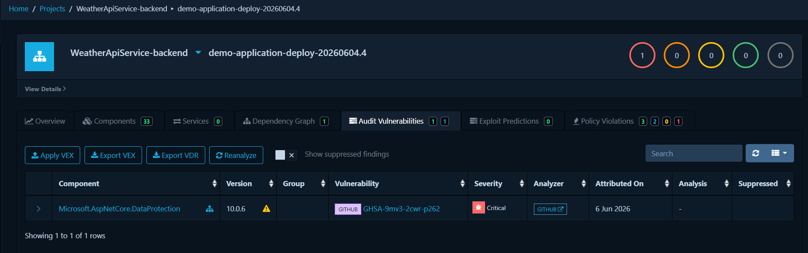

And we see that we use a component for which we do not know the license. This could be an issue, and it is important to investigate it. In this case, FluentAssertions 8.0 transitioned from the open-source Apache 2.0 license to a commercial license managed, requiring a paid subscription for commercial use. This is a good example of why it is important to track licenses as well, and not just vulnerabilities.

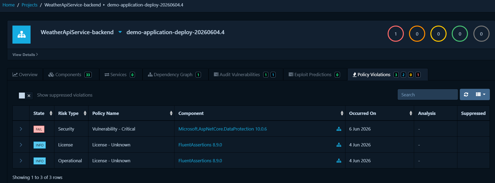

The same goes for the frontend project.

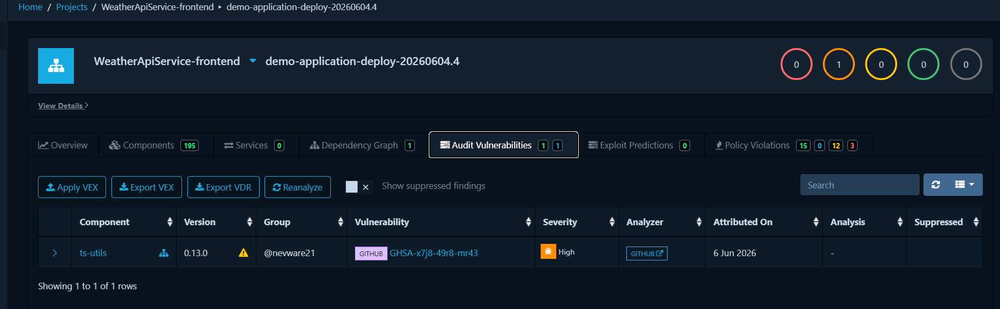

### Vulnerability Audit

On this page you can investigate any vulnerability across all projects. Quickly identify which projects are affected by a specific vulnerability and drill down into the details of the vulnerability itself. This is useful when you want to understand the impact of a newly disclosed vulnerability or track the status of a known issue across your portfolio.

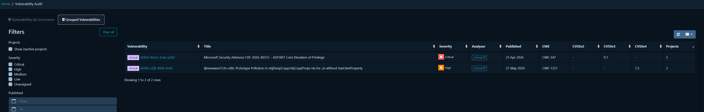

### Policy Violation Audit

On this page you can investigate policy violations across all projects. For example, you can review license violations across the portfolio and quickly identify components that break your defined policies. Use filters such as Violation State, Risk Type, and Policy Name to focus on the most critical issues.

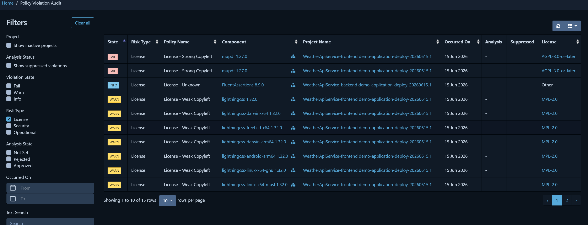

> A useful future feature in Dependency-Track would be better grouping of components and project names, because this view can become noisy.

A short recap on license types follows. This is a high-level summary only, not legal advice.

Recap:

- **Non-Commercial (NC) license**
  - A license that prohibits commercial use of the software. Examples include the Creative Commons Non-Commercial (CC BY-NC) and the GNU General Public License for Non-Commercial Use (GPL-NC). For commercial use, these licenses are problematic as they restrict the ability to use the software in a commercial context.
- **(Strong) Copyleft**
  - A license that requires derivative works to be licensed under the same terms, often with additional restrictions. Examples include the GNU General Public License (GPL) and Affero General Public License (AGPL). For commercial use, these licenses can be problematic because they may require releasing source code for derivative works.
- **Weak Copyleft**
  - A license that allows derivative works to be licensed under different terms, but still requires attribution and may have some restrictions. Examples include the Mozilla Public License (MPL) and Eclipse Public License (EPL). These licenses are generally more permissive than strong copyleft licenses, but they still require you to comply with certain conditions when using the software. You must release source code for modifications to the licensed component. You do not need to release source code for separate proprietary software that merely links to or uses the component.
- **Unknown**
  - A license that cannot be identified or is not recognized by the system. This can occur when a component does not have a clear license or when the license information is not properly documented. Unknown licenses can pose a risk as they may have unknown restrictions or obligations.

---

## Next guide

When a build pipeline runs frequently, Dependency-Track accumulates a project/version entry for every build. Most of these versions are no longer deployed anywhere and are not relevant to current risk. Over time this clutters the project list and creates noise around vulnerabilities in versions that are not in production. With more applications and more builds, this problem only gets worse.

In the next part, see [../40-dependency-track-helper/README.md](../40-dependency-track-helper/README.md). There, the pipeline is adjusted and a helper service is introduced for opinionated lifecycle improvements.
