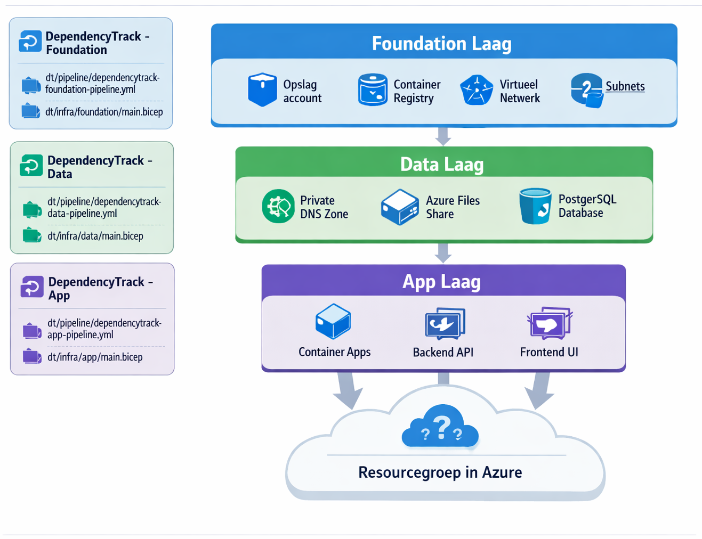
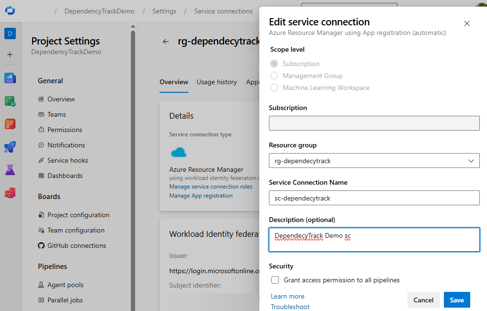
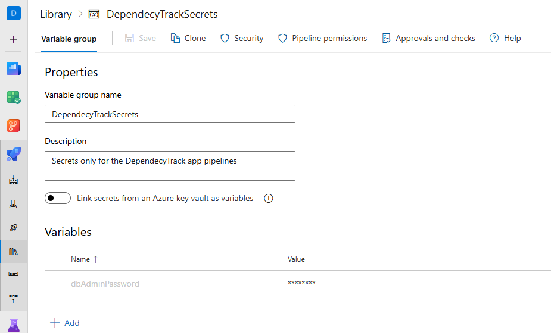
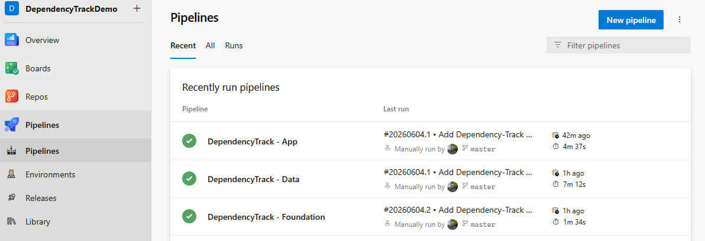
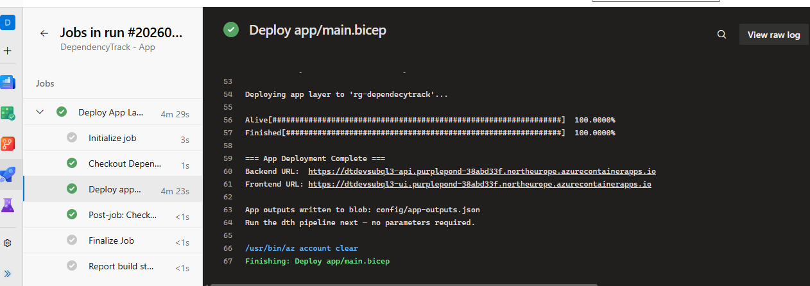

# Dependency-Track Deployment, Configuration, and Implementation Guide

After you complete the demo application guide in [../20-demo-application/README.md](../20-demo-application/README.md), continue with the Dependency-Track deployment, configuration, and implementation guides in this folder. This guide is organized into three sections.

- Start with [Dependency-Track Azure Deployment steps](#dependency-track-azure-deployment-steps) for the Azure subscription and Azure DevOps setup steps.
- After deployment, use [Dependency-Track Configuration steps](#dependency-track-configuration-steps) to configure Dependency-Track.
- Then continue with [Dependency-Track Implementation steps](#dependency-track-implementation-steps) for the walkthrough on integrating Dependency-Track into the demo application CI/CD pipelines.

---

## Dependency-Track Azure Deployment steps

The `dt/` folder contains all infrastructure as code and pipeline definitions for the Azure deployment. It is organized into two main subfolders: `infra/` for Bicep files and `pipeline/` for Azure DevOps pipeline YAML files.

### Azure Subscription

If you are using a new Azure subscription for this setup, prepare it before creating the service connection and running the pipelines.

1. Sign in to <https://portal.azure.com/> and switch to the correct Microsoft Entra tenant.
2. Navigate to `Subscriptions` and select the correct one.
3. Register the required resource providers under `Subscriptions` > `Resource providers`:
   - `Microsoft.App`
   - `Microsoft.DBforPostgreSQL`
   - `Microsoft.Network`
   - `Microsoft.Storage`
4. Provider registration can take a few minutes. If a pipeline fails with a provider or resource type error immediately after starting, check the registration status in the portal.
5. Navigate to `Resource groups`, create a resource group named `rg-dependecytrack`, and select the subscription for this demo.

#### What gets created On Azure

All resources land in a single resource group; they are created by three pipelines with three related Bicep files.



##### Foundation layer

- Storage account (`Standard_LRS`, TLS 1.2 only, no public blob access)
  - Blob container `config` for pipeline parameter handoff between stages
- Azure Container Registry (`Basic` SKU, admin user enabled) — used for DTH API image builds and pulls
- Virtual network (`10.0.0.0/22`) with two delegated subnets
  - `snet-containers` (`10.0.0.0/23`) — delegated to `Microsoft.App/environments`
  - `snet-db` (`10.0.2.0/24`) — delegated to `Microsoft.DBforPostgreSQL/flexibleServers`

##### Data layer

- Azure Files share `vulnerability-data` (50 GB) on the foundation storage account — mounted at `/data` inside the DT API server container so vulnerability mirrors survive container restarts
- Private DNS zone `privatelink.postgres.database.azure.com` with a VNet link
- PostgreSQL 16 Flexible Server (`Standard_B1ms`, burstable) — VNet-injected into `snet-db`, no public internet access
- PostgreSQL database `dependencytrack`

##### App layer

- Container Apps managed environment — VNet-integrated into `snet-containers`
- `dependencytrack/apiserver` Container App (1 CPU, 2 Gi) with the Azure Files volume mounted at `/data`
- `dependencytrack/frontend` Container App (0.25 CPU, 0.5 Gi) with the API URL injected at runtime

#### Additional notes

- All shared configuration (service connection, resource group name, region, image names) is defined once in `dt/pipeline/variables/common.yml`
- The `dbAdminPassword` is read automatically from the `DependecyTrackSecrets` variable group — no manual parameter passing is needed.
  - **Secret handling:** `dbAdminPassword` is mapped to the `DB_ADMIN_PASSWORD` environment variable inside the `AzureCLI@2` task. It is never expanded inline in the script.
- For network security a VNet is created in the foundation layer and used by both the data and app layers.

### Step 1. Create the Azure service principal and service connection

Create an `Azure Resource Manager` service connection named `sc-dependecytrack` for the resource group `rg-dependecytrack`. This name must match the value in `dt/pipeline/variables/common.yml`.

- In DevOps, go to `Project Settings`, followed by `Service Connections`. Click on `Create service connection`, select `App registration`, `Workload Identity federation`, `Subscription` and `rg-dependecytrack`, name it `sc-dependecytrack`.

For this demo, `Contributor` on the resource group is sufficient. If you scope permissions more narrowly, make sure the service principal can deploy networking, Container Apps, PostgreSQL, and read storage account keys.



### Step 2. Store secrets as pipeline variables

The `dbAdminPassword` is required by both the data pipeline and the app pipeline. Store it as a secret pipeline variable so it is masked in logs and never committed to source control.

In Azure DevOps we do it via a Variable group (shared across pipelines):

1. Go to `Pipelines` > `Library`.
2. Create a variable group named `DependecyTrackSecrets`.
3. Add a variable named `dbAdminPassword`, set a strong value, and mark it as secret.
4. Authorize the variable group for the pipelines when Azure DevOps prompts on first use.
   - Password requirements: Be at least 8 characters; contain characters from three of the following: uppercase, lowercase, digits, special characters; not contain the username



### Step 3. Create the Azure DevOps pipelines

Create three pipelines in Azure DevOps:

| Pipeline name | YAML file |
| --- | --- |
| `DependencyTrack - Foundation` | `dt/pipeline/dependecytrack-foundation-pipeline.yml` |
| `DependencyTrack - Data` | `dt/pipeline/dependecytrack-data-pipeline.yml` |
| `DependencyTrack - App` | `dt/pipeline/dependecytrack-app-pipeline.yml` |

For each pipeline:

1. Go to `Pipelines` > `New pipeline`.
2. Connect to your repository.
3. Select `Existing Azure Pipelines YAML file`.
4. Pick the YAML file path from the table above.
5. Save (do not run yet).

### Step 4. Run the Pipelines

1. Run the `DependencyTrack - Foundation` pipeline.
   - Foundation outputs written to blob: config/foundation-outputs.json
2. Run the `DependencyTrack - Data` pipeline.
   - Data outputs written to blob: config/data-outputs.json
3. Run the `DependencyTrack - App` pipeline.

- When complete, the job log shows the backend URL and the frontend URL. Save these URLs for the next guide.



Open the `Frontend URL` in a browser. The Dependency-Track login page should appear within a few seconds. The API server can take 1–2 minutes to fully initialize on first start while it populates the vulnerability database from its mirrors.



### Tear down when done

When you are finished with the demo, remove everything including the Storage Account and the resource group itself:

```bash
az group delete --name rg-dependecytrack --yes
```

### Production Considerations

For production use, apply standard security and reliability hardening, for example:

- Rewrite pipeline yaml deploy code, the code does the job but no do not use it in production.
- Store secrets in Azure Key Vault.
- Improve pipeline secret handoff and access controls.
- Harden PostgreSQL configuration and choose an appropriate production SKU.
- Place an API gateway and WAF in front of Container Apps.
- Use private endpoints where possible, and restrict access to private networks.
- Scale Container Apps and database resources based on expected load.

I could go on but you get the point: do not use this setup as-is in production. It is intentionally optimized for demo and evaluation purposes.

---

## Dependency-Track Configuration steps

This section covers the steps to configure Dependency-Track after a successful deployment. Complete these steps before connecting any projects or uploading SBOMs.

So let's configure Dependency-Track!


### First Login

1. Open the frontend URL from the app pipeline output (e.g., `https://<baseName>-ui.<region>.azurecontainerapps.io`).
2. The login page appears. Log in with the default credentials:
   - **Username:** `admin`
   - **Password:** `admin`

> The API server can take 1–2 minutes to respond on first start while it initialises the database schema and downloads initial vulnerability feed data. If the login page appears but the API returns errors, wait 60 seconds and refresh.


#### Change the Admin Password

Changing the default password is the first thing you should do before any other configuration.

1. Log in with `admin` / `admin`.
2. Click your username in the top-right corner and select `Change Password`.
3. Enter the current password (`admin`) and a new strong password.
4. Click `Update Password`.

> **Note**: strange for a product from the OWASP Foundation and it does not have any password policies, oke you should use a external authentication provider in production, but still, consider enforcing a strong password here.

### Administration

#### Configure General Settings

Under `Administration` > `Configuration`:

| Setting | Recommended value | Notes |
| --- | --- | --- |
| **Base URL** | Your frontend URL | Used in notification e-mails and links. Set to the `frontendUrl` from the app pipeline. |
| **Default language** | As preferred | |


#### Manage Teams and API Keys

Dependency-Track uses teams to control what CI/CD pipelines and users can do. An API key is associated with a team and carries that team's permissions.

#### Create a team

1. Go to `Administration` > `Access Management` > `Teams`.
2. Open the `automation` team.
3. Assign permissions to the team. For a CI/CD pipeline that uploads SBOMs and reads vulnerability results, assign at minimum:
   - `BOM_UPLOAD`
   - `VIEW_PORTFOLIO`
   - `VULNERABILITY_ANALYSIS`
   - `PROJECT_CREATION_UPLOAD`

#### Generate an API key

1. Open the team you created.
2. Click `API Keys`.
3. Click `+` to generate a new key.
4. Copy the key, it is only shown once. Store it in your CI/CD system as a secret.

The API key is passed in the `X-Api-Key` header for all authenticated API calls.


#### Configure Analyzers

In this demo, enabling fuzzy matching options in internal analyzers improved the chance of matching potential CPE entries. Use this carefully, because fuzzy matching can also introduce false positives.


#### Configure Vulnerability Sources

Dependency-Track mirrors vulnerability data from external sources into the `/data` directory. On first start, it downloads data from all enabled sources. This can take 10–20 minutes.

Built-in data sources enabled by default:

| Source | Description |
| --- | --- |
| **NVD** (National Vulnerability Database) | CVE records from NIST |
| **OSV** (Open Source Vulnerabilities) | Google's open-source vulnerability database |
| **GitHub Advisories** | Vulnerability advisories from GitHub |
| **VulnDB** (optional, requires license) | Commercial vulnerability data |

To configure data sources:

1. Go to `Administration` > `Vulnerability Sources`.
2. Each source has a toggle to enable it.
3. For **NVD**, optionally configure an [NVD API key](https://nvd.nist.gov/developers/request-an-api-key). Without a key, NVD uses a lower rate limit — mirroring is slower but still works.

##### GitHub Advisory

Create a GitHub personal access token (PAT) without any scopes and configure it in Dependency-Track under the GitHub Advisories configuration.

This improves vulnerability matching because the [National Vulnerability Database (NVD)](https://nvd.nist.gov/) identifies products with [CPEs](https://nvd.nist.gov/products/cpe), while modern package ecosystems such as NuGet and npm use [PURLs](https://github.com/package-url/purl-spec). For example, an AutoMapper vulnerability may be represented in NVD as `cpe:2.3:a:luckypennysoftware:automapper:*:*:*:*:*:*:*:*`, while the package in an SBOM is identified as `pkg:nuget/AutoMapper@15.1.1`.

GitHub Advisory data uses PURLs, which makes matching significantly more accurate for modern package managers.


###### Why CPE-to-PURL matching is unreliable

Matching an SBOM that uses PURLs against NVD data is a [known challenge](https://github.com/DependencyTrack/dependency-track/discussions/4180). PURLs identify specific packages, while CPEs describe broader products. Automated conversion is not always reliable. Since CVE 5.2 the CVE record format supports PURLs, but many existing vulnerability records still do not include them. GitHub Advisory data solves this gap for the NuGet and npm ecosystems.

##### Google OSV Advisory

Enable the Google OSV Advisory source for the same reason as GitHub Advisories: OSV uses PURLs natively, which improves matching accuracy for packages that NVD does not cover well.

Before enabling OSV, make sure the **NuGet** and **npm** ecosystems are selected in the OSV configuration panel inside Dependency-Track. Enabling OSV for all ecosystems is also fine but will increase the initial mirror time.


After enabling all sources, Dependency-Track starts a background mirror task. Progress can be monitored under `Administration` > `Scheduled Tasks`.

##### Disable license expression validation

Some generated SBOMs are rejected on upload because of license validation errors. Certain NuGet packages contain a license value such as `Unknown - See URL`, which Dependency-Track treats as invalid. When validation is enabled, these uploads return **HTTP 400**.

To disable validation:

1. Go to `Administration` > `Configuration`.
2. Find the **BOM Processing** section.
3. Disable the `Validate BOM before processing` toggle.
4. Click `Save`.


##### Configure internal components

Internal components are your own libraries and services. Dependency-Track excludes them from license-policy violations and can apply different vulnerability handling rules.

To identify internal components by package group:

1. Go to `Administration` > `Configuration`.
2. Find the **Internal Components** section.
3. Enter a regex pattern that matches the package group or namespace of your internal packages. For example, `^com\.example\..*` matches all packages in the `com.example` namespace.
4. Click `Save`.

Components matching the pattern are marked as internal. They appear in the component list with an **Internal** badge and are excluded from the `License - Unknown` policy condition above.


### Policy Management

Create policies so Dependency-Track flags license issues and known vulnerabilities. Policies are evaluated against every component in every project and surface as violations on the project findings page.

To create a policy:

1. Go to `Administration` > `Policy Management`.
2. Click `+` to create a new policy.
3. Set the **Violation State** (`Inform`, `Warn`, or `Fail`) and add one or more conditions.
4. Optionally scope the policy to specific projects or tags. Leave unscoped to apply globally.

Recommended starter policies:

| Name | Violation State | Condition(s) |
| --- | --- | --- |
| License - Non-Commercial | Fail | `License group is Non-Commercial` |
| License - Strong Copyleft | Fail | `License group is Copyleft` |
| License - Weak Copyleft | Warn | `License group is Weak Copyleft` |
| License - Unknown | Inform | `License is unresolved` AND `Component is classified as internal` is `false` |
| Vulnerability - Critical | Fail | `Severity is Critical` |
| Vulnerability - High | Fail | `Severity is High` |
| Vulnerability - Medium | Inform | `Severity is Medium` OR `Severity is Low` |

In addition to these general rules, you can define policies targeting specific packages or version ranges. This is a starting point; customize and expand policies based on your organization's risk tolerance and compliance requirements.


#### Considerations

This is a starting point for policy management,a and not what i ended up for productions. Do your own experiments, but note that:

- The `License - Unknown` policy is important to identify components that are missing license information. This can be a sign of an incomplete SBOM or a component that needs manual review. By excluding internal components from this policy, you can focus on third-party dependencies that may pose legal risks. *BUT*, this policy will also create a large amount of noise if your SBOMs are missing license data for many components. If you have a large number of violations from this policy, consider improving the quality of your SBOMs or disabling the policy until you can address the underlying issue.
- The `License - Weak Copyleft` policy will flag a lot of open source components which properly will not be a problem for your organization, unlike the permissive licenses.
- Vulnerability policies are optional. If enabled, a vulnerability can appear both as a vulnerability finding and as a policy violation. Depending on your preferred workflow, you may choose to keep policies only for license rules.

---

## Dependency-Track Implementation steps

In this section we go through the implementation steps. The end result is that after a build runs, two new projects appear in Dependency-Track with their own component and vulnerability list.

The integration adds two capabilities to the demo application's existing Azure DevOps pipelines:

1. **SBOM generation** — After each build on `main`/`master`, a CycloneDX SBOM is generated for the backend (NuGet) and frontend (npm).
1. **SBOM upload** — After each build on `main`/`master`, the generated SBOMs are uploaded to Dependency-Track.

The demo application has two build jobs defined in:

- `demo/pipeline/templates/application/build-backend-job.yml` — builds the .NET backend
- `demo/pipeline/templates/application/build-frontend-job.yml` — builds the React frontend

The SBOM steps are added to these existing jobs.

### Variable group setup

First, create an Azure DevOps variable group named **`DependencyTrackGroup`** and link it to the demo application deployment pipeline (`demo/pipeline/application-deployment-pipeline.yml`). This group centralizes the connection details for Dependency-Track.

| Variable | Description |
| --- | --- |
| `DependencyTrackUrl` | Base URL of the Dependency-Track API server, e.g. `https://<baseName>-api.<region>.azurecontainerapps.io` |
| `DependencyTrackApiKey` | API key from the `Automation` team in Dependency-Track (store as secret) |
| `githubPat` | A GitHub PAT without additional permissions (store as secret) |

In Azure DevOps:

1. Go to `Pipelines` > `Library`.
2. Create a variable group named `DependencyTrackGroup`.
3. Add the three variables above. Mark `DependencyTrackApiKey` and `githubPat` as secret.
4. Link the group to the application deployment pipeline under `Edit` > `Variables` > `Variable groups`.


### CI/CD Integration

#### Reusable SBOM create and upload template

In your repository, create a new reusable template at `demo/pipeline/templates/application/tasks/build-create-and-upload-sbom.yml`. This file is not present in the repository today. The template wraps three steps:

1. **Generate** a CycloneDX SBOM — uses `dotnet CycloneDX` for NuGet projects and `cdxgen` for npm projects.
2. **Publish** the SBOM as a pipeline artifact so it is retained with the build.
3. **Upload** the SBOM to Dependency-Track via its REST API using the `Automation` team API key.

See the [template file](./assets/build-create-and-upload-sbom.yml) for the content and for the full implementation. The template accepts parameters for the target type (NuGet or npm), application name, component name, working directory, target file, and SBOM output directory.

*Resolving licenses*
The template queries public registries to improve license resolution. This increases build time, but significantly reduces unresolved licenses. For npm, set the environment variable `FETCH_LICENSE=true`. Also set `GITHUB_TOKEN`; otherwise, API rate limits may prevent license resolution.


#### Variable group update

Then add the newly created variable group to the variables section in `demo/pipeline/application-deployment-pipeline.yml`:

```yaml

variables:
  - template: /demo/pipeline/templates/variables/common.yml
  - group: DependencyTrackGroup

```


#### Build jobs update

Then edit the existing `demo/pipeline/templates/application/build-backend-job.yml` file. Add a SBOM step that runs only on builds from `main` or `master`. Insert it after the existing publish step:

```yaml
      - ${{ if or(eq(variables['Build.SourceBranch'], 'refs/heads/main'), eq(variables['Build.SourceBranch'], 'refs/heads/master')) }}:
          - template: tasks/build-create-and-upload-sbom.yml
            parameters:
              targetType: nuget
              applicationName: WeatherApiService
              applicationComponentName: backend
              workingDirectory: $(Build.SourcesDirectory)/demo/backend
              targetFile: $(Build.SourcesDirectory)/demo/backend/WeatherApiService.Api/WeatherApiService.Api.csproj
              sbomOutputDirectory: $(Build.SourcesDirectory)/demo/backend/.well-known/sbom
```

Then edit the existing `demo/pipeline/templates/application/build-frontend-job.yml` file. Add an SBOM step that also runs only on `main`/`master`. Insert it after the existing build step:

```yaml
      - ${{ if or(eq(variables['Build.SourceBranch'], 'refs/heads/main'), eq(variables['Build.SourceBranch'], 'refs/heads/master')) }}:
        - template: tasks/build-create-and-upload-sbom.yml
          parameters:
            targetType: npm
            applicationName: WeatherApiService
            applicationComponentName: frontend
            workingDirectory: $(Build.SourcesDirectory)/demo/frontend
            targetFile: $(Build.SourcesDirectory)/demo/frontend/package-lock.json
            sbomOutputDirectory: $(Build.SourcesDirectory)/demo/frontend/public/.well-known/sbom
```


Now save and commit the changes. Then push a new commit to `main`/`master` to trigger the pipeline and review the results in Dependency-Track. Ensure permissions are granted to the variable group.

After these steps run, Dependency-Track will show two projects, `WeatherApiService (backend)` and `WeatherApiService (frontend)`, each with their own component list and vulnerability findings.

To have a clearer view for the last part of the tutorial, execute a second build.

### Dependency-Track at a glance

This tutorial focuses on the implementation of the SBOM upload to Dependency-Track. If you want to learn more about Dependency-Track itself, check out the [Dependency-Track documentation](https://docs.dependencytrack.org/) and the [Dependency-Track user guide](https://docs.dependencytrack.org/userguide/).

This section also gives a short tour of the Dependency-Track UI and its main features.

> **Note**: Background jobs in Dependency-Track may take time to start and complete. On the first run, downloading vulnerability data can take up to **24 hours**. If you just uploaded an SBOM, allow time for components and vulnerabilities to appear in the UI. (so be patient ;) )

#### Dashboard

The dashboard provides an overview of the portfolio, including the number of projects, components, and vulnerabilities. It also highlights any critical issues that need attention. You can see the increase or decrease over time and notice if you need to investigate a sudden increase in vulnerabilities or a new critical issue.

As seen in the screenshot below, the dashboard shows that we have 2 projects (the backend and frontend), a total of 11 components across both projects, and 3 vulnerabilities. The critical issues section highlights any vulnerabilities that are marked as critical severity.


#### Projects

The projects page lists all projects in the portfolio. Each project has its own page with a component list, vulnerability findings, and policy violations. This is where you can drill down into the details of each project and see which components are used and what vulnerabilities are associated with them.

As seen in the screenshot below, the `WeatherApiService (backend)` project has 3 violations and 1 vulnerability, while the `WeatherApiService (frontend)` project has 15 violations and 1 vulnerability. You can click into each project to see more details about the components and vulnerabilities.


We can drill down further into the `WeatherApiService (backend)` project to see the list of components and their associated vulnerabilities. For example, we can see that the `Microsoft.AspNetCore.DataProtection` component is used in the backend project and has a known vulnerability with a critical severity.

> **Note**: As we can see, due to 2 builds, we have 2 versions for each of the two projects. As a result we see that the same vulnerabilities and same policy violations are found in the projects. This is something you might want to take action on, because the fix is really simple: you can update the package to a newer version that has the vulnerability fixed. This is a good example of why it is important to have a lifecycle management strategy for your projects and their components.


And we see that we use a component for which we do not know the license. This could be an issue, and it is important to investigate it. In this case, FluentAssertions 8.0 transitioned from the open-source Apache 2.0 license to a commercial license managed, requiring a paid subscription for commercial use. This is a good example of why it is important to track licenses as well, and not just vulnerabilities.


The same goes for the frontend project. Which has a component with a known vulnerability.


#### Vulnerability Audit

On this page you can investigate any vulnerability across all projects. Quickly identify which projects are affected by a specific vulnerability and drill down into the details of the vulnerability itself. This is useful when you want to understand the impact of a newly disclosed vulnerability or track the status of a known issue across your portfolio.


#### Policy Violation Audit

On this page you can investigate policy violations across all projects. For example, you can review license violations across the portfolio and quickly identify components that break your defined policies. Use filters such as Violation State, Risk Type, and Policy Name to focus on the most critical issues.


> A useful future feature in Dependency-Track would be better grouping of components and project names, because this view can become noisy.

A short recap on license types follows. This is a high-level summary only, not legal advice.

Recap:

- **Non-Commercial (NC) license**
  - A license that prohibits commercial use of the software. Examples include the Creative Commons Non-Commercial (CC BY-NC) and the GNU General Public License for Non-Commercial Use (GPL-NC). For commercial use, these licenses are problematic as they restrict the ability to use the software in a commercial context.
- **(Strong) Copyleft**
  - A license that requires derivative works to be licensed under the same terms, often with additional restrictions. Examples include the GNU General Public License (GPL) and Affero General Public License (AGPL). For commercial use, these licenses can be problematic because they may require releasing source code for derivative works.
- **Weak Copyleft**
  - A license that allows derivative works to be licensed under different terms, but still requires attribution and may have some restrictions. Examples include the Mozilla Public License (MPL) and Eclipse Public License (EPL). These licenses are generally more permissive than strong copyleft licenses, but they still require you to comply with certain conditions when using the software. You must release source code for modifications to the licensed component. You do not need to release source code for separate proprietary software that merely links to or uses the component.
- **Unknown** (not really a type of license, but a status in Dependency-Track)
  - A license that cannot be identified or is not recognized by the system. This can occur when a component does not have a clear license or when the license information is not properly documented. Unknown licenses can pose a risk as they may have unknown restrictions or obligations.

---

## Final guide

When a build pipeline runs frequently, Dependency-Track accumulates a project/version entry for every build. Most of these versions are no longer deployed anywhere and are not relevant to current risk. Over time this clutters the project list and creates noise around vulnerabilities in versions that are not in production. With more applications and more builds, this problem only gets worse.

In the next part, see [../40-dependency-track-helper/README.md](../40-dependency-track-helper/README.md). There, the pipeline is adjusted and a helper service is introduced for opinionated lifecycle improvements.
