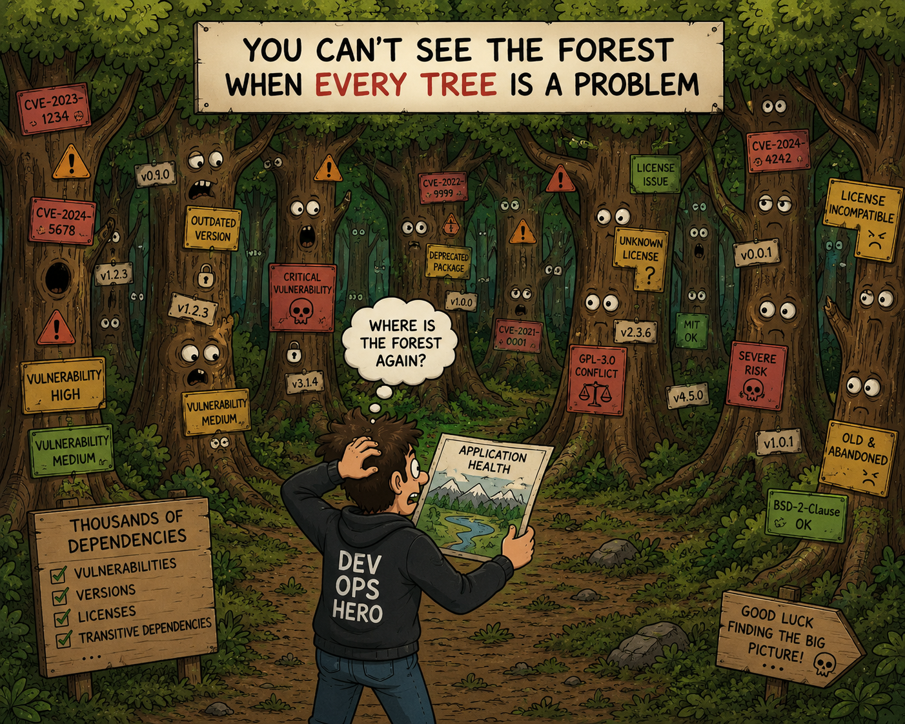

# Dependency-Track Helper API

See [../30-dependency-track/README.md](../30-dependency-track/README.md) for the previous guide.

This guide describes an opinionated improvement introduced to make the solution more manageable, based on a customer implementation. The guide is split into three sections:

- Start with [The Dependency-Track Helper API case](#the-dependency-track-helper-api-case) for the problem description and the proposed solution.
- The next section [Dependency-Track Helper API details](#dependency-track-helper-api-details) describes the inner workings and implementation of the API.
- The last section [Dependency-Track Helper Implementation](#dependency-track-helper-implementation) describes the implementation of the API and the changes needed in the demo application pipeline to use it.

## The Dependency-Track Helper API case

### The problem

When a build pipeline runs frequently, Dependency-Track accumulates a project version entry for every build. Most of these versions are no longer deployed anywhere and are not relevant to current risk. Over time this clutters the project list and creates noise around vulnerabilities in versions that are not in production.

Key observations:

- Many builds never reach the production environment.
- Managing old builds is time-consuming, and Dependency-Track does not have a built-in way to handle this automatically.



### Proposed solution

After some experimentation with DevOps pipeline scripts and pipeline extensions to manage Dependency-Track projects, the result was a helper service.

A minimal ASP.NET Core API automates Dependency-Track project lifecycle operations for versioned applications. The service exposes a single endpoint for project organization and maintenance.

#### Typical use case

1. The CI/CD pipeline creates a BOM when the application is built.
2. Before the app is deployed to production, the CI/CD pipeline uploads the BOM directly to Dependency-Track, for example for `WeatherApiService` version `1.2.3`.
  - The project becomes available in Dependency-Track, vulnerability and license analysis are performed, and notifications are triggered if configured.
3. After step 2, the CI/CD pipeline calls this Helper API for `WeatherApiService` version `1.2.3`.
  - Analysis results are evaluated. If any Critical or High findings exist, the service fails, which causes the pipeline to fail. That prevents deployment until the issues are resolved.
4. When step 3 succeeds, then the WeatherApiService is actually deployed to the PROD environment.
5. After step 4, the CI/CD pipeline calls this Helper API for `WeatherApiService` version `1.2.3`. The helper service executes four phases.
   - The new version becomes active and latest is set.
   - A Parent project is created if needed, and the relation is set.
   - Older versions are deactivated (with the same application name).
   - Older versions are optionally pruned (with the same application name)


## Dependency-Track Helper API details

The API automates Dependency-Track project lifecycle operations for versioned applications. It is designed to be called from CI/CD pipelines after uploading a BOM to Dependency-Track, so it can manage project versions through a single operation. For this demo, the pre-deployment validation call from step 3 is not implemented.

The Dependency-Track Helper application is located in the `dth` folder. Dependency-Track supports project and version management through its REST API, but recurring release lifecycle tasks are operational work. This API wraps those tasks into one endpoint so pipelines can call a single operation.

1. The CI/CD pipeline creates a BOM when the application is built.
2. Before the app is deployed to production, the CI/CD pipeline uploads the BOM directly to Dependency-Track, for example for `WeatherApiService` version `1.2.3`.
  - The project is available in Dependency-Track, vulnerability and license analysis run, and notifications are triggered if configured.
3. Then the WeatherApiService is actually deployed to the PROD environment.
4. After step 3, the CI/CD pipeline calls this Helper API for `WeatherApiService` version `1.2.3`. The helper service executes four phases.
   - The new version becomes active and latest is set.
   - A Parent project is created if needed, and the relation is set.
   - Older versions are deactivated (with the same application name).
   - Older versions are optionally pruned (with the same application name)


> **Note**: This demo does not include the pre-deployment gate with validation check code. You can add this yourself.

### Tech stack

Minimal ASP.NET Core API that automates Dependency-Track project lifecycle operations for versioned applications.

- .NET net10.0 minimal API
- Typed repository layer for Dependency-Track HTTP calls
- Explicit process context propagation for API key
- Structured logging with process-phase messages

### API contract

#### Health endpoint

- Method: GET
- Path: /health
- No authentication required

Returns `200 OK` with `{ "status": "ok" }`.

#### Project process endpoint

- Method: POST
- Path: /api/v1/projectprocess
- Required header: X-Api-Key

The API key is forwarded to Dependency-Track for upstream calls.

#### Request body

The endpoint accepts `ProjectProcessRequestDto` with these JSON fields:

- projectName (string, required)
- version (string, required)
- activateVersion (bool, optional)
- cleanInactiveProjects (int, optional)
- parentName (string, optional)

#### Behavior details

When the endpoint is called:

1. Parent resolution
     - If parentName is provided, parent lookup is executed in Dependency-Track.
     - If not found, a parent project is created.

2. Target activation
     - Target project is looked up by projectName + version.
     - Target is updated to active = true and isLatest = true.
     - If parent is resolved, parent relation is applied.

3. Sibling deactivation
     - Other projects with the same name are updated to active = false and isLatest = false.

4. Cleanup
     - Inactive versions are sorted by lastBomImport desc, then version desc.
     - If cleanInactiveProjects is missing or <= 0, deletion is skipped.
     - Otherwise, only the newest cleanInactiveProjects inactive versions are retained.
     - Older inactive versions are deleted.

#### Success response

Returns 200 OK with:

```json
{
    "projectUuid": "3c570e4a-8d5b-4a3a-9f8c-a4ed7a4f2d9a",
    "projectName": "my-app",
    "version": "1.2.3",
    "active": true,
    "isLatest": true,
    "parentUuid": "f7cb4a8b-33d2-49e8-a622-f90a2fae612d",
    "deactivatedCount": 4,
    "deletedInactiveCount": 2
}
```

#### Error responses

- 400 Bad Request: missing or invalid request body values
- 401 Unauthorized: missing X-Api-Key
- 404 Not Found: target project version does not exist in Dependency-Track
- 500 Internal Server Error: local configuration or processing failure
- 502 Bad Gateway: Dependency-Track request failed upstream

---

### Configuration

Configuration key:

```json
{
    "DependencyTrack": {
        "BaseUrl": "https://your-dependency-track-host"
    }
}
```

Files:

- appsettings.json

The application loads configuration from the configuration file and environment variables.

Set nested values with double underscores, for example:

- DependencyTrack__BaseUrl=<https://your-dependency-track-host>

---

### Example requests

cURL:

```bash
curl -X POST `
    "https://dtdevsubql3-api.purplepond-38abd33f.northeurope.azurecontainerapps.io/api/v1/projectprocess" `
    -H 'X-Api-Key: xxxxxxxxxxxxxxxxxxxxxxxxxxxxxxxxxxxxxxxxxxxxxxx' `
    -H "Content-Type: application/json" `
    -d '{ "projectName": "WeatherApiService-backend", "version": "0.51.0-pbi.27", "activateVersion": true, "cleanInactiveProjects": 3, "parentName": "WeatherApiService" }'    `
    --verbose --show-headers --ssl-no-revoke
```

## Dependency-Track Helper Implementation

### Dependency-Track Helper pipeline

First, deploy the Dependency-Track Helper application to Azure. The deployment runs through an Azure DevOps pipeline, similar to the main Dependency-Track deployment, but with a simpler Bicep template because it only needs a Container App and a managed identity.

The Bicep template for the helper app is in `dth/infra/app/main.bicep`. Also review the values defined in the pipeline variables folder. After creating the Azure DevOps pipeline, run it to deploy the helper app.

In your Azure DevOps project, create a new pipeline using `dth/pipeline/dependencytrackhelper-pipeline.yml`. Run the pipeline to deploy the helper application. When complete, the job log shows the helper API URL. Save this URL for later.


### Dependency-Track modification

Go to the Dependency-Track UI and open `Administration` > `Access Management` > `Teams`. Open the **Automation** team and add the **`PORTFOLIO_MANAGEMENT`** permission. Save.


If you forget this step, the helper API will not be able to perform project lifecycle management operations, and you will see 403 Forbidden errors in the helper API logs when it tries to call the Dependency-Track API. In the logs of the SBOM upload step in the build pipeline of the demo, you will see an error about Could not create parent project.

> **Note**: This permission is required for the API key to perform project lifecycle management operations. It is not needed for basic SBOM upload and vulnerability checks. For security best practices, consider creating a separate API key with only the necessary permissions for the helper service. You have to change the helper app implementation to use the new API key if you go this route.

### Pipeline Variable group modifications

Add one variable to the existing **`DependencyTrackGroup`** variable group:

| Variable | Description |
| --- | --- |
| `DependencyTrackHelperUrl` | Base URL of the Dependency-Track Helper API, e.g. `https://<baseName>-dth.<region>.azurecontainerapps.io` |

### Demo App Pipeline modifications

Remove the previous template `demo/pipeline/templates/application/tasks/build-create-and-upload-sbom.yml` and replace it with `demo/pipeline/templates/application/tasks/build-create-sbom.yml`, which only creates the SBOM. See [./assets/build-create-sbom.yml](./assets/build-create-sbom.yml) for the full template content.


Next, fix the existing `demo/pipeline/templates/application/build-backend-job.yml` file:

```yaml
      - ${{ if or(eq(variables['Build.SourceBranch'], 'refs/heads/main'), eq(variables['Build.SourceBranch'], 'refs/heads/master')) }}:
          - template: tasks/build-create-sbom.yml
            parameters:
              targetType: nuget
              applicationName: WeatherApiService
              applicationComponentName: backend
              workingDirectory: $(Build.SourcesDirectory)/demo/backend
              targetFile: $(Build.SourcesDirectory)/demo/backend/WeatherApiService.Api/WeatherApiService.Api.csproj
              sbomOutputDirectory: $(Build.SourcesDirectory)/demo/backend/.well-known/sbom
```

Then edit the existing `demo/pipeline/templates/application/build-frontend-job.yml` file:

```yaml
      - ${{ if or(eq(variables['Build.SourceBranch'], 'refs/heads/main'), eq(variables['Build.SourceBranch'], 'refs/heads/master')) }}:
        - template: tasks/build-create-sbom.yml
          parameters:
            targetType: npm
            applicationName: WeatherApiService
            applicationComponentName: frontend
            workingDirectory: $(Build.SourcesDirectory)/demo/frontend
            targetFile: $(Build.SourcesDirectory)/demo/frontend/package-lock.json
            sbomOutputDirectory: $(Build.SourcesDirectory)/demo/frontend/public/.well-known/sbom
```


Because the SBOM is no longer uploaded during build, the deploy step should perform the upload.

First, add a reusable SBOM upload template named `demo/pipeline/templates/application/tasks/deploy-upload-sbom.yml`. See [./assets/deploy-upload-sbom.yml](./assets/deploy-upload-sbom.yml) for the full template content.


Then we edit the existing `demo/pipeline/templates/application/deploy-environment-stage.yml` file to add a call to the new template:

```yaml
      - job: DeploySbom
        displayName: Deploy SBOM for ${{ parameters.environmentName }}
        pool:
          vmImage: $(vmImage)
        condition: and(succeeded(), eq('${{ parameters.environmentName }}', 'prd'))
        dependsOn:
          - DummyDeploy
        steps:
          - template: tasks/deploy-upload-sbom.yml
            parameters:
              environmentName: ${{ parameters.environmentName }}
              applicationName: WeatherApiService
              applicationComponentNames:
                - frontend
                - backend
```


> **Note**: In this tutorial, SBOM upload runs only in the `prd` stage. You can adjust this behavior to match your own release flow.

Save and commit the changes. Then push a new commit to `main`/`master` to trigger the pipeline and review the results in Dependency-Track.

### Dependency-Track end results

Open the Dependency-Track UI and go to the main dashboard. This overview shows current software risk based on uploaded SBOMs and configured policies. In this example, one project is marked high risk and one medium risk, which gives a clearer signal than the previous approach.


Next, go to `Projects` > `WeatherApiService`. Notice the separation between active and inactive project versions, and that only the active version is marked as latest. This is the result of calling the helper API in the deploy stage.

This gives you a cleaner view of production risk without noise from old, non-deployed builds. Dependency-Track aggregates data per application, which becomes especially useful as the number of applications grows.


You can still investigate older versions if needed, but they are not cluttering the main view of the project.


If you fix the identified issues in the demo code, you can end up with a clean Dependency-Track instance with no problematic policy violations and no vulnerabilities.


When you change the level of the `License - Weak Copyleft` policy violation to `Info`, you can see that all issues will be resolved and the project is in a healthy state.


---

## Conclusion

This concludes the integration improvements. Project maintenance is now automated, so you can focus on SBOM quality and policy management to improve risk visibility. You can further customize helper API behavior.

Besides that, you can test and experiment with Dependency-Track features, such as:

- Notifications and integrations with Jira, Slack, Teams, etc.
  - Tip enabling notifications is a must, but you could overflow your team with alerts.
- User management and authentication providers: For any organization, this is essential and relatively easy to configure.
- Policy management and custom policy improvements: Experiment with this to find a configuration that matches your organization.
- Exploitability Context (VEX) documents to suppress known vulnerabilities in SBOMs: Some vulnerabilities are known to be non-exploitable in your environment.
- Improved license deduction to reduce unknown licenses and false positives: One approach is to route SBOMs through the Helper API and enrich license metadata before upload, but this introduces external static configuration that must be maintained.
- DevOps pipeline improvements, such as SBOM validation and fail-fast gates.

As earlier mentioned, you can improve the deployment of Dependency-Track and harden the security of the solution.

---

You have reached the end of the tutorial.


