# Dependency-Track Helper API

See [../30-dependency-track/README-implementation.md](../30-dependency-track/README-implementation.md) for the previous guide.

This section describes an opinionated improvement introduced to make the solution more manageable, based on an implementation done at a customer.

- [Dependency-Track Helper API](#dependency-track-helper-api)
  - [The problem](#the-problem)
    - [Proposed solution](#proposed-solution)
      - [Typical use case](#typical-use-case)
    - [The helper application](#the-helper-application)
  - [Steps](#steps)
    - [Dependency-Track Helper pipeline](#dependency-track-helper-pipeline)
    - [Dependency-Track modification](#dependency-track-modification)
    - [Pipeline Variable group](#pipeline-variable-group)
    - [Demo App Pipeline Modification](#demo-app-pipeline-modification)
      - [Build](#build)
      - [Deploy](#deploy)
  - [Dependency-Track Clean view](#dependency-track-clean-view)
  - [Conclusion](#conclusion)

---

## The problem

When a build pipeline runs frequently, Dependency-Track accumulates a project version entry for every build. Most of these versions are no longer deployed anywhere and are not relevant to current risk. Over time this clutters the project list and creates noise around vulnerabilities in versions that are not in production.

Key observations:

- Many builds never reach the production environment.
- Managing old builds is time-consuming, and Dependency-Track does not have a built-in way to handle this automatically.

### Proposed solution

After some experimentation with DevOps pipeline scripts and pipeline extensions to manage Dependency-Track projects, the result was a helper service.

A minimal ASP.NET Core API automates Dependency-Track project lifecycle operations for versioned applications. The service exposes a single endpoint for project organization and maintenance.

#### Typical use case

1. The CI/CD pipeline creates a BOM when the application is built.
2. Before the app will be deployed to prod, the CI/CD pipeline uploads the BOM directly to Dependency-Track, e.g for WeatherApiService version 1.2.3.
   2.1 The project is usable in Dependency-Track, vulnerability and license analysis will be done, the results are visible in Dependency-Track. Notifications are triggered if configured.
3. After step 2, the CI/CD pipeline calls this Helper API for WeatherApiService /1.2.3. The helper service will do 1 check.
   3.1 Analyze results are checked. If any Critical or High, then the service fails, which causes the pipeline to fail. Which means the new version cannot be deployed to production until the issues are resolved.
4. When step 3 succeeds, then the WeatherApiService is actually deployed to the PROD environment.
5. After step 4, the CI/CD pipeline calls this Helper API for WeatherApiService /1.2.3. The helper service will do 4 phases.
   5.1 The new version becomes active and latest is set.
   5.2 A Parent project is created if needed, and the relation is set.
   5.3 Older versions are deactivated (with the same application name).
   5.4 Older versions are optionally pruned (with the same application name)

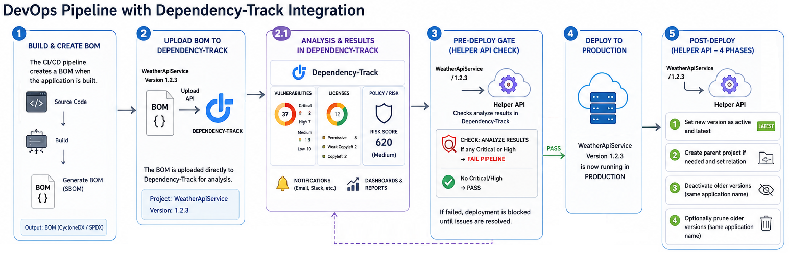

### The helper application

The API automates Dependency-Track project lifecycle operations for versioned applications. The API is designed to be called from CI/CD pipelines after uploading a BOM to Dependency-Track, so it can manage project versions with a single operation. For this demo, the API call for step 3 is not implemented.

The Dependency-Track Helper application is located in the `dth` folder. See [README-design.md](README-design.md) for architecture and implementation details.

---

## Steps

### Dependency-Track Helper pipeline

First, deploy the Dependency-Track Helper application to Azure. The deployment runs through an Azure DevOps pipeline, similar to the main Dependency-Track deployment, but with a simpler Bicep template because it only needs a Container App and a managed identity.

The Bicep template for the helper app is in `dth/infra/app/main.bicep`. Also review the values defined in the pipeline variables folder. After creating the Azure DevOps pipeline, run it to deploy the helper app.

In your Azure DevOps project, create a new pipeline using `dth/pipeline/dependencytrackhelper-pipeline.yml`. Run the pipeline to deploy the helper application. When complete, the job log shows the helper API URL. Save this URL for later.

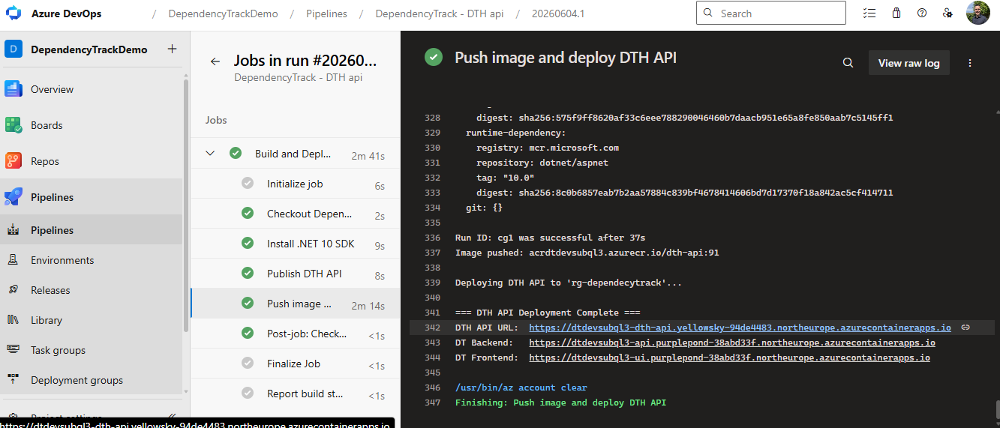

### Dependency-Track modification

Go to the Dependency-Track UI and open `Administration` > `Access Management` > `Teams`. Open the **Automation** team and add the **`PORTFOLIO_MANAGEMENT`** permission. Save.

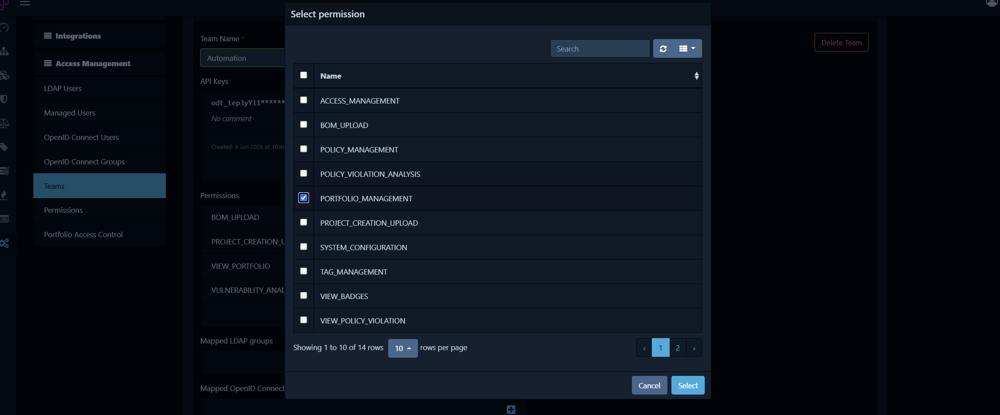

If you forget this step, the helper API will not be able to perform project lifecycle management operations, and you will see 403 Forbidden errors in the helper API logs when it tries to call the Dependency-Track API. In the logs of the SBOM upload step in the build pipeline of the demo, you will see an error about Could not create parent project.

> **Note**: This permission is required for the API key to perform project lifecycle management operations. It is not needed for basic SBOM upload and vulnerability checks. For security best practices, consider creating a separate API key with only the necessary permissions for the helper service. You have to change the helper app implementation to use the new API key if you go this route.

### Pipeline Variable group

Add one variable to the existing **`DependencyTrackGroup`** variable group:

| Variable | Description |
| --- | --- |
| `DependencyTrackHelperUrl` | Base URL of the Dependency-Track Helper API, e.g. `https://<baseName>-dth.<region>.azurecontainerapps.io` |

### Demo App Pipeline Modification

#### Build

Remove the previous template `demo/pipeline/templates/application/tasks/build-create-and-upload-sbom.yml` and replace it with `demo/pipeline/templates/application/tasks/build-create-sbom.yml`, which only creates the SBOM. See [./assets/build-create-sbom.yml](./assets/build-create-sbom.yml) for the full template content.

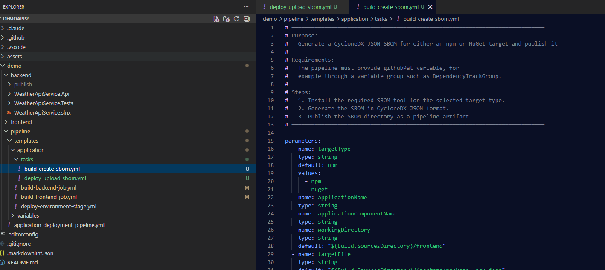

Next, fix the existing `demo/pipeline/templates/application/build-backend-job.yml` file:

```yaml
      - ${{ if or(eq(variables['Build.SourceBranch'], 'refs/heads/main'), eq(variables['Build.SourceBranch'], 'refs/heads/master')) }}:
          - template: tasks/build-create-sbom.yml
            parameters:
              targetType: nuget
              applicationName: WeatherApiService
              applicationComponentName: backend
              workingDirectory: $(Build.SourcesDirectory)/demo/backend
              targetFile: $(Build.SourcesDirectory)/demo/backend/WeatherApiService.Api/WeatherApiService.Api.csproj
              sbomOutputDirectory: $(Build.SourcesDirectory)/demo/backend/.well-known/sbom
```

Then edit the existing `demo/pipeline/templates/application/build-frontend-job.yml` file:

```yaml
      - ${{ if or(eq(variables['Build.SourceBranch'], 'refs/heads/main'), eq(variables['Build.SourceBranch'], 'refs/heads/master')) }}:
        - template: tasks/build-create-sbom.yml
          parameters:
            targetType: npm
            applicationName: WeatherApiService
            applicationComponentName: frontend
            workingDirectory: $(Build.SourcesDirectory)/demo/frontend
            targetFile: $(Build.SourcesDirectory)/demo/frontend/package-lock.json
            sbomOutputDirectory: $(Build.SourcesDirectory)/demo/frontend/public/.well-known/sbom
```

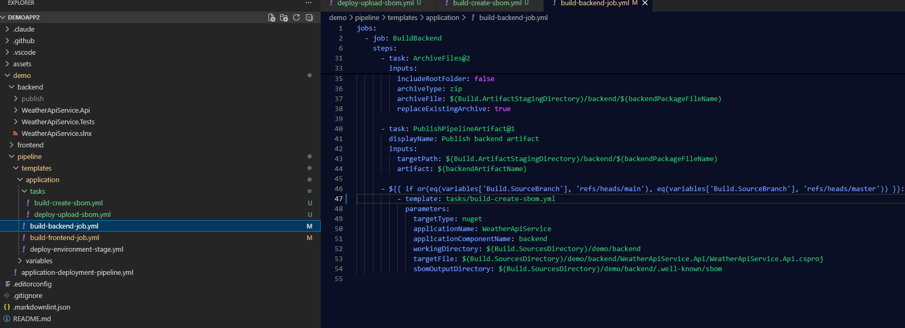

#### Deploy

Because the SBOM is no longer uploaded during build, the deploy step should perform the upload.

First, add a reusable SBOM upload template named `demo/pipeline/templates/application/tasks/deploy-upload-sbom.yml`. See [./assets/deploy-upload-sbom.yml](./assets/deploy-upload-sbom.yml) for the full template content.

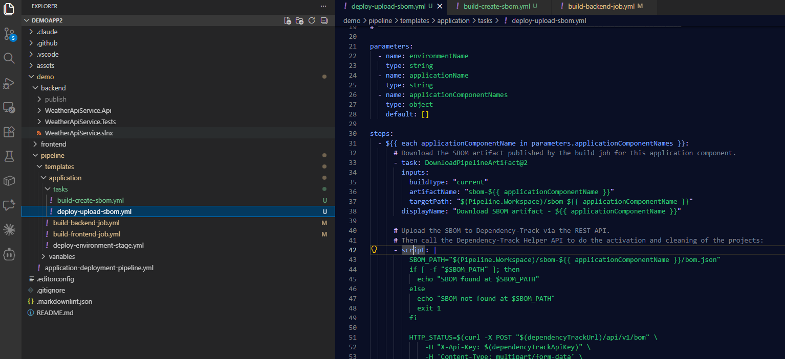

Then we edit the existing `demo/pipeline/templates/application/deploy-environment-stage.yml` file to add a call to the new template:

```yaml
      - job: DeploySbom
        displayName: Deploy SBOM for ${{ parameters.environmentName }}
        pool:
          vmImage: $(vmImage)
        condition: and(succeeded(), eq('${{ parameters.environmentName }}', 'prd'))
        dependsOn:
          - DummyDeploy
        steps:
          - template: tasks/deploy-upload-sbom.yml
            parameters:
              environmentName: ${{ parameters.environmentName }}
              applicationName: WeatherApiService
              applicationComponentNames:
                - frontend
                - backend
```

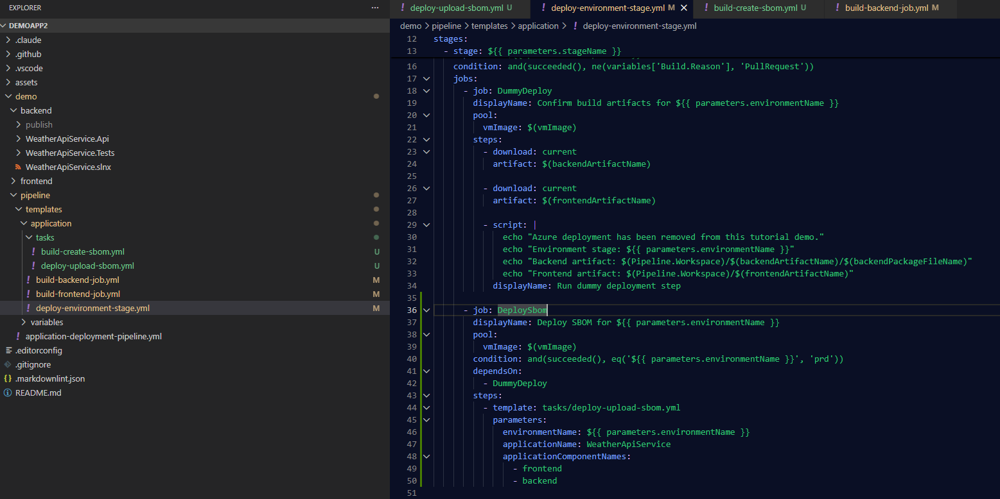

> **Note**: In this tutorial, SBOM upload runs only in the `prd` stage. You can adjust this behavior to match your own release flow.

Save and commit the changes. Then push a new commit to `main`/`master` to trigger the pipeline and review the results in Dependency-Track.

## Dependency-Track Clean view

Open the Dependency-Track UI and go to the main dashboard. This overview shows current software risk based on uploaded SBOMs and configured policies. In this example, one project is marked high risk and one medium risk, which gives a clearer signal than the previous approach.

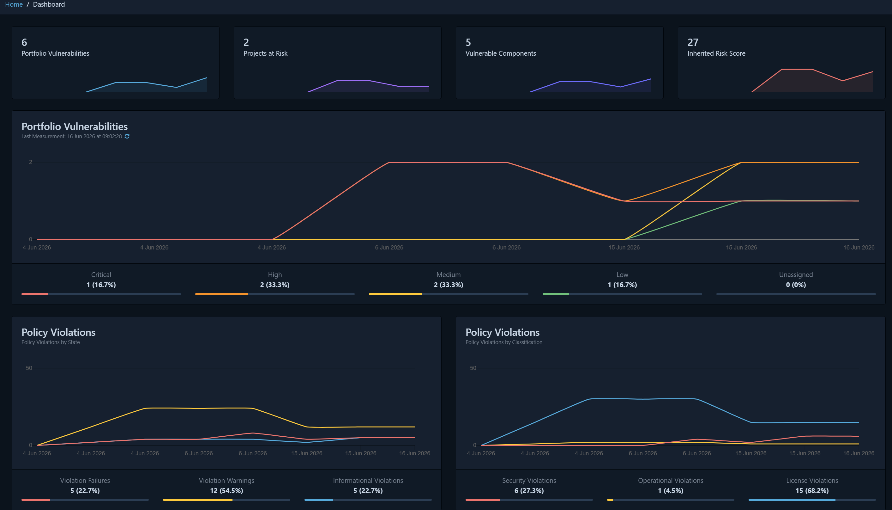

Next, go to `Projects` > `WeatherApiService`. Notice the separation between active and inactive project versions, and that only the active version is marked as latest. This is the result of calling the helper API in the deploy stage.

This gives you a cleaner view of production risk without noise from old, non-deployed builds. Dependency-Track aggregates data per application, which becomes especially useful as the number of applications grows.

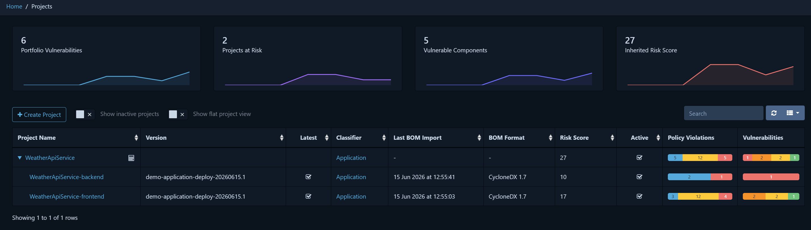

You can still investigate older versions if needed, but they are not cluttering the main view of the project.


If you fix the identified issues in the demo code, you can end up with a clean Dependency-Track instance with no policy violations and no vulnerabilities.

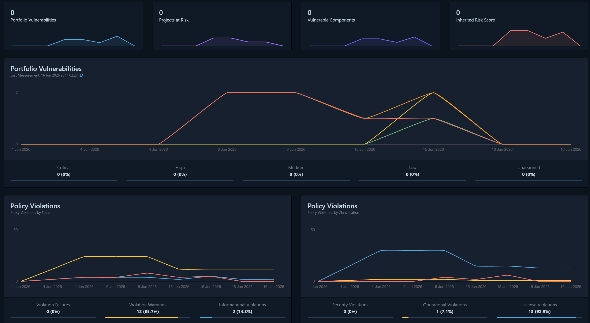

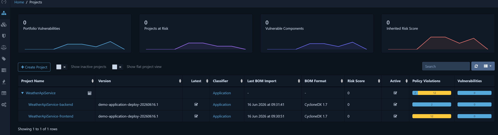

## Conclusion

This concludes the integration improvements. Project maintenance is now automated, so you can focus on SBOM quality and policy management to improve risk visibility. You can further customize helper API behavior.

Beside that, you can test and experiment with Dependency-Track features, such as:

- Notifications and integrations with Jira, Slack, Teams, etc.
- User management and authentication providers
- Policy management and custom policies improvements
- Exploitability Context (VEX) documents to suppress known vulnerabilities in SBOMs
- Improved License deduction to reduce unknown licenses and false positives.
- DevOps pipeline improvements, such as SBOM validation and pipeline failing.

As earlier mentioned, you can improve the deployment of Dependency-Track and harden the security of the solution.

---

You have reached the end of the tutorial.
