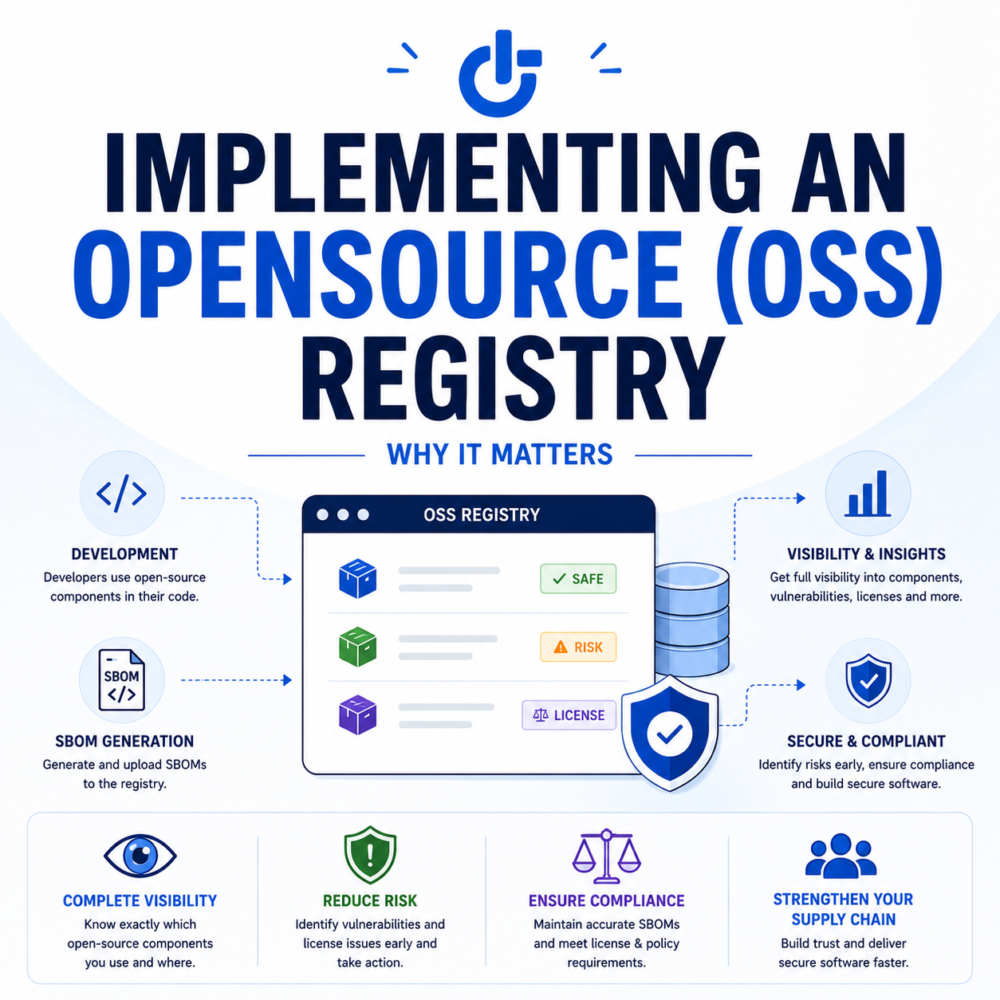
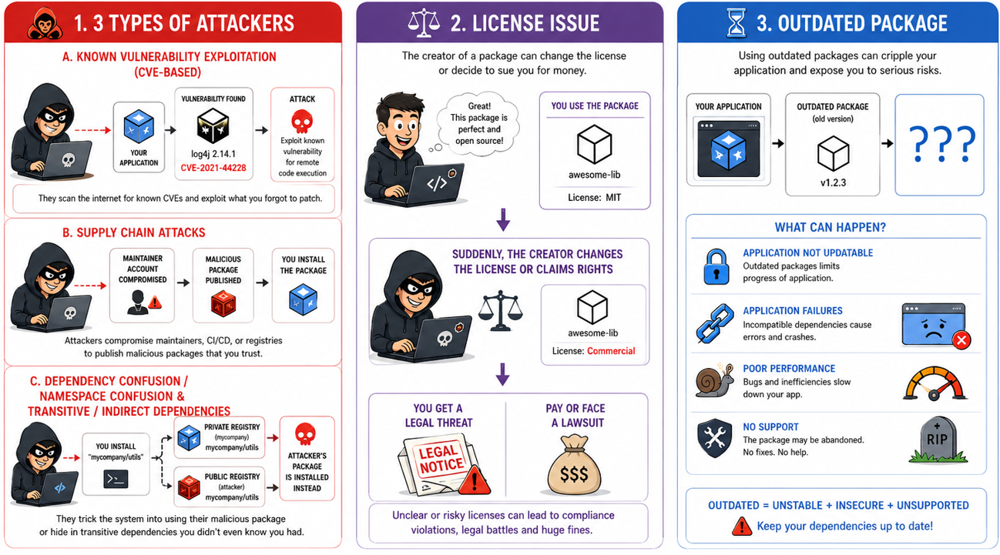
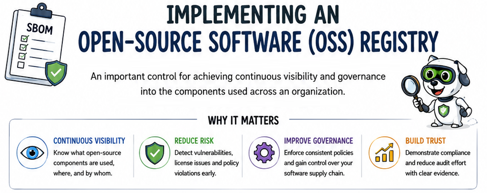
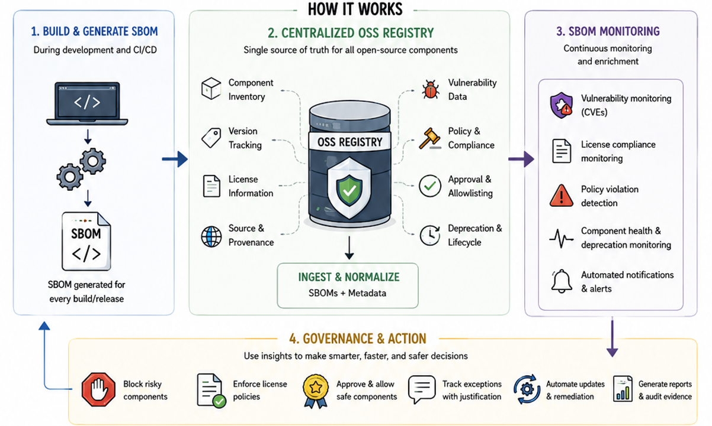
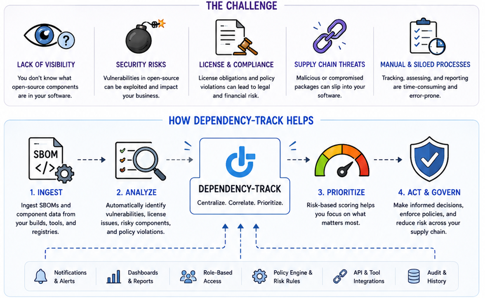
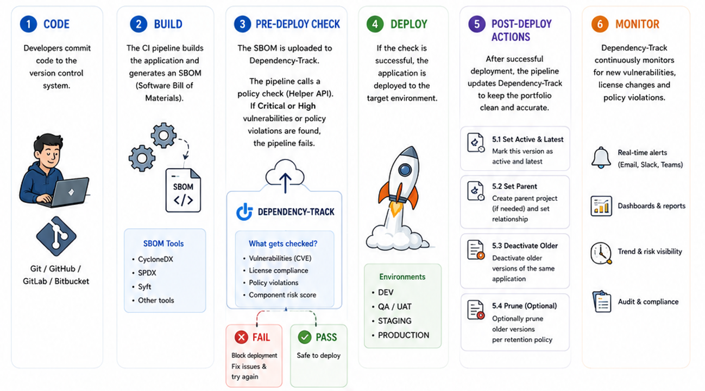
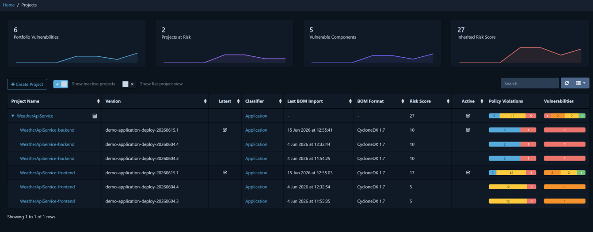
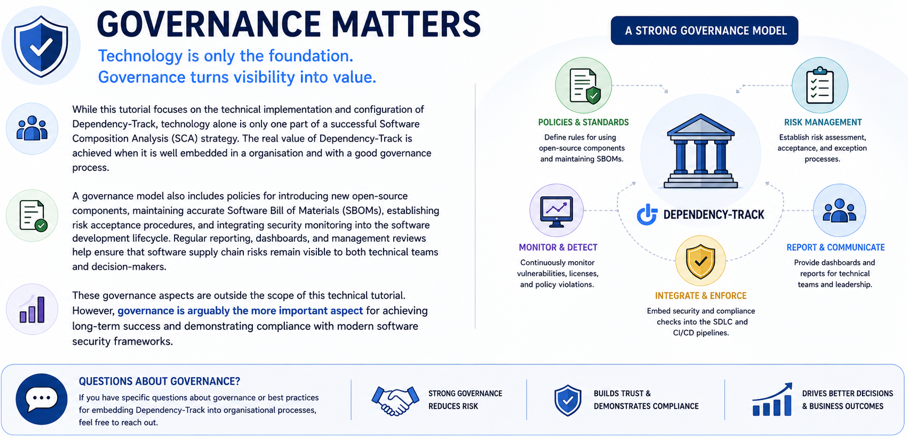
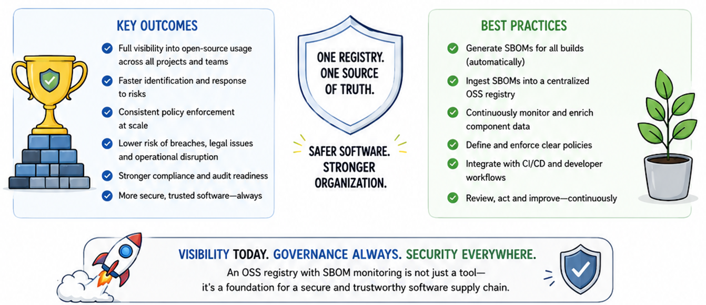

# Why Organizations Need an Open-Source Software Registry

## Sybren Roede – XPRTZ.net

## Problems that organizations can face

## Implementing an open-source software (OSS) registry

### OSS registry implementation

## A possible solution – Dependency-Track

## Ci/Cd Pipeline with Dependency-Track Integration

## Dependency-Track findings

## Governance

## Outcome

